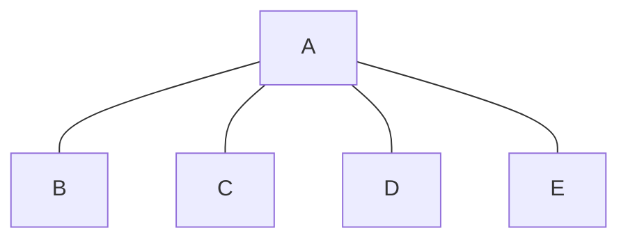

# Graphs

## Basic Info : 

### Key Points to Remember : 
1. If there are n nodes then the maximum number of edges in an undirected graph is $${}_n C_2 = \frac{n(n-1)}{2}$$
2. If there are n nodes then the maximum number of edges in a directed graph is $n(n-1)$ (Because for each node we can have an edge to all other nodes).


## Representation of Graphs : 
Example Graph :


### 1. Adjacency Matrix : 

|   | A | B | C | D | E |
|---|---|---|---|---|---|
| A | 0 | 1 | 1 | 1 | 1 |
| B | 1 | 0 | 0 | 0 | 0 |
| C | 1 | 0 | 0 | 0 | 0 |
| D | 1 | 0 | 0 | 0 | 0 |
| E | 1 | 0 | 0 | 0 | 0 |


### 2. Adjacency List : 

- `A`: `[B, C, D, E]`
- `B`: `[A]`
- `C`: `[A]`
- `D`: `[A]`
- `E`: `[A]`


## Graph Traversals : 

### 1. Depth First Search (DFS) : 

- Visit the current node and mark it as visited.
- Recursively visit all the unvisited neighbors of the current node.
- Backtrack to the previous node and continue the process until all nodes are visited.


```cpp
dfs(node, visited, adjList){
    visited[node] = true;
    // Do anything (Ex Print etc)

    for(node in adjList[node]){
        if(!visited[node]) dfs(node, visited, adjList);
    }

    // If you want to store the traversal in stack do here  stack.push(node)
    return;
}
```

### 2. Breadth First Search (BFS) : 

- Visit the current node and mark it as visited.
- Recursively visit `all the unvisited neighbors of the current node.`
- Backtrack to the previous node and continue the process until all nodes are visited.

```cpp
bfs(start_node, visited, adjList){
    queue<int> q;
    q.push(start_node);
    visited[start_node] = true;

    while(!q.empty()){
        int node = q.front(); q.pop();
        // Do anything (Ex Print etc)

        for(node in adjList[node]){
            if(!visited[node]){
                q.push(node);
                visited[node] = true;
            }
        }
    }
    return;
}
```


