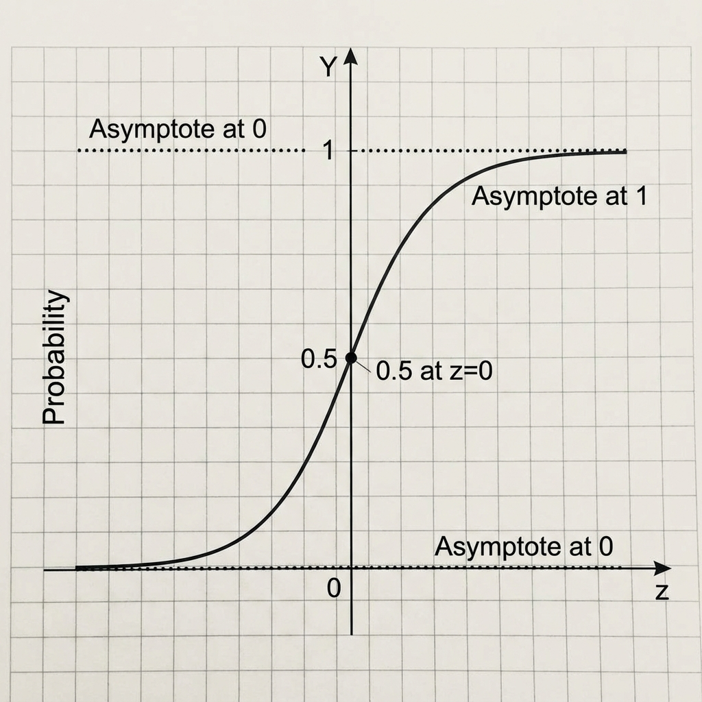

# Logistic Regression: Improving the Perceptron Trick

> **Goal**: Fix the flaws of the Perceptron Trick by introducing "Distance" and "Probability" into the equation.

### 1. The Flaw: "Pull" but no "Push"
In the Perceptron Trick, we only update the line when a point is **misclassified**.
*   **Wrongly Classified**: "Pulls" the line towards itself (Correct behavior).
*   **Correctly Classified**: Does **nothing**.
    *   *Issue*: A point that is *barely* correct (distance = 0.0001) is treated the same as a point that is *very* confident (distance = 100).
    *   *Desire*: We want "safe" points to **PUSH** the line away to increase the margin (Safety Gap).

<!-- 
IMAGE_PROMPT: 
Type: Concept Diagram
Description: 
- Side-by-Side comparison.
- Left (Perceptron): Misclassified point pulling the line. Correct point doing nothing.
- Right (Desired): Misclassified point pulling, BUT Correct point also PUSHING the line away (creating margin).
Style: Educational / Handwritten style arrows.
-->

### 2. The Solution: From Step to Sigmoid
To incorporate "Push" and "Distance", we change the activation function.

$$ \hat{y} = \text{Step}(z) \implies \hat{y} = \sigma(z) $$

**The Sigmoid Function**:
$$ \sigma(z) = \frac{1}{1 + e^{-z}} $$

*   **Mapping**:
    *   $z = 0 \rightarrow 0.5$ (Unsure)
    *   $z \to +\infty \rightarrow 1$ (Confident Positive)
    *   $z \to -\infty \rightarrow 0$ (Confident Negative)

> **Key Insight**: By using Sigmoid, every point (even correct ones) contributes a probabilistic value between 0 and 1. We essentially transform the "Line" into a "Probability Landscape".

<!-- 
IMAGE_PROMPT: 
Type: Graph
Description: 
- Standard Sigmoid Curve (S-shape) centered at 0.
- X-axis: z (Distance). Y-axis: $\sigma(z)$ (Probability).
- Annotations: "0.5 at z=0", "Approaches 1", "Approaches 0".
Style: Mathematical Graph.
-->

### 3. The "Conviction" Problem
Even with Sigmoid, if we stick to the **Random Point selection** (Perceptron Algorithm), we have an issue:
*   We pick random points and nudge the line.
*   We might find *a* solution that separates the data (like the Sklearn Implementation vs Perceptron line).
*   **But is it the BEST solution?** No.
*   We cannot say with **conviction** that we have the optimal line because we are just reacting to random points.

<!-- 
IMAGE_PROMPT: 
Type: Scatter Plot
Description: 
- Comparison of three lines on a classification dataset.
- Line 1 (Perceptron Step): Separates data but very close to points (Bad margin).
- Line 2 (Perceptron Sigmoid): Slightly better.
- Line 3 (Optimal/Sklearn): Perfectly centered with max margin.
- Label: "Lack of Conviction" for the first two.
Style: Data Viz.
-->

### 4. Conclusion: We need a Loss Function
To get the **Best** solution with conviction, we stop "guessing" based on random points.
Instead:
1.  We define a **loss function** that measures *total* error across ALL points.
2.  We mathematically **minimize** this function.

> **Next Step**: Deriving the Log Loss (Binary Cross Entropy) to guide our Gradient Descent.
