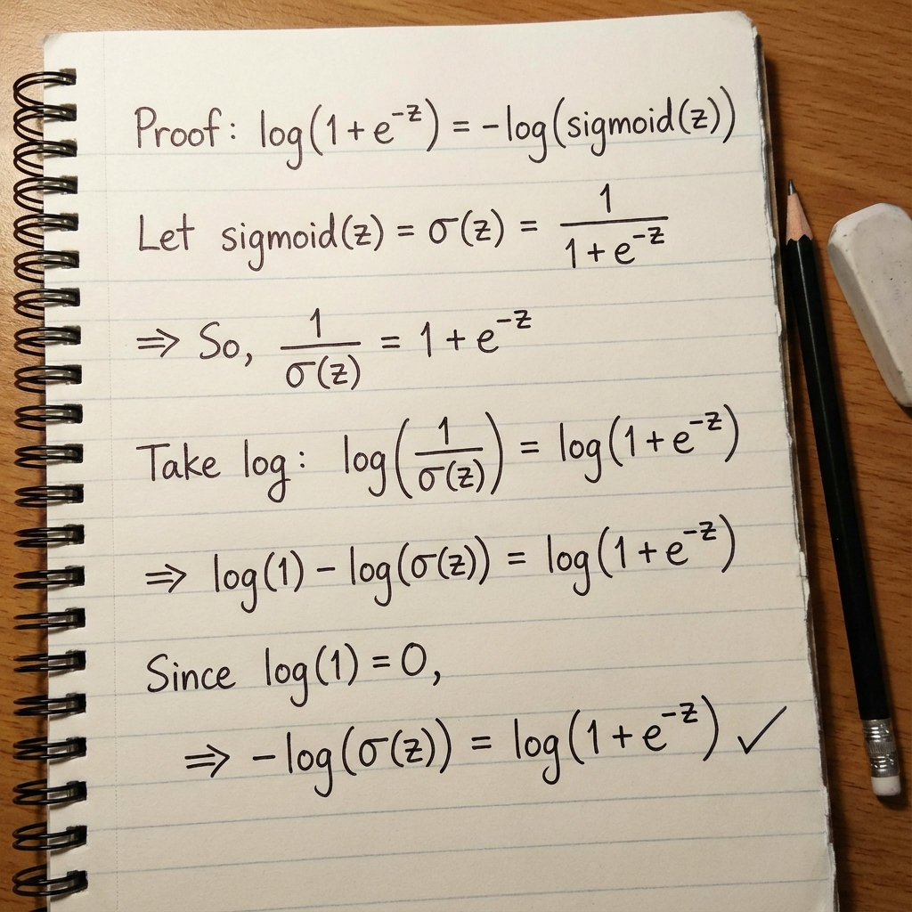

# Logistic Regression: Detailed Summary

> **Goal**: Mastering the "Probabilistic" nature, Label conventions, and Scikit-Learn implementation.

### 1. Probabilistic Intuition (The "Odds" View)
*   **Odds**: $\frac{P}{1-P}$. Ratio of event happening vs not.
*   **Log Odds (Logit)**: $\log(\frac{P}{1-P})$.
*   **Assumption**: Log Odds are **Linear**.
    $$ \log \left( \frac{P}{1-P} \right) = w^T x + b $$
    $$ P = \sigma(z) = \frac{1}{1 + e^{-z}} $$

<!-- 
IMAGE_PROMPT: 
Type: Concept Graph
Description: 
- Show the transformation.
- Left: Linear Regression Line ($-\infty$ to $+\infty$). Label "Log Odds".
- Arrow: "Apply Sigmoid / Inverse Logit".
- Right: S-Curve (0 to 1). Label "Probability".
Style: Educational transformation flow.
-->


---

### 2. Label Conventions: $\{0, 1\}$ vs $\{-1, 1\}$
Mathematically, they achieve the same thing but look different.

| Feature | Standard $\{0, 1\}$ | Theoretical/SVM $\{-1, 1\}$ |
| :--- | :--- | :--- |
| **Prediction** | $\sigma(z)$ | $\text{sign}(z)$ (for class) |
| **Loss** | Binary Cross Entropy | Log-Loss (Margin based) |
| **Formula** | $-[y \log(\hat{y}) + (1-y)\log(1-\hat{y})]$ | $\log(1 + e^{-yz})$ |
| **Connection** | If $y=1$, Loss $= -\log(\sigma(z))$ | If $y=1$, Loss $= \log(1+e^{-z}) \approx -\log(\sigma(z))$ |

<!-- 
IMAGE_PROMPT: 
Type: Equation Comparison
Description: 
- Side-by-Side derivation snippet.
- Show that $\log(1 + e^{-z})$ is mathematically identical to $-\log(\frac{1}{1+e^{-z}})$.
- Proven equivalence of the two loss functions.
Style: Handwritten note style.
-->



---

### 3. Python Implementation (Scikit-Learn)
Sklearn handles both label types automatically.

```python
from sklearn.linear_model import LogisticRegression
from sklearn.preprocessing import StandardScaler
import numpy as np

# Data Generation
X = np.array([[1], [2], [3], [4], [5]])
y_01 = np.array([0, 0, 0, 1, 1])       # Standard
y_11 = np.array([-1, -1, -1, 1, 1])    # SVM style

# scaling
scaler = StandardScaler()
X_scaled = scaler.fit_transform(X)

# Model 1: Standard 0/1
model_a = LogisticRegression(C=1.0)
model_a.fit(X_scaled, y_01)
print(f"Preds (0/1): {model_a.predict(X_scaled)}")

# Model 2: Labels -1/1
# sklearn detects the classes involved automatically!
model_b = LogisticRegression(C=1.0)
model_b.fit(X_scaled, y_11)
print(f"Preds (-1/1): {model_b.predict(X_scaled)}")
```

### 4. Hyperparameters (Interview Focus)
1.  **`penalty`**: `l1` (Lasso - Feature Selection), `l2` (Ridge - Default), `elasticnet`.
2.  **`C`**: **Inverse** of Regularization ($\frac{1}{\lambda}$).
    *   Small `C` = Big $\lambda$ = High Bias (Underfitting).
    *   Large `C` = Small $\lambda$ = High Variance (Overfitting).
3.  **`solver`**:
    *   `liblinear`: Good for small data, supports L1.
    *   `sag`/`saga`: Fast for big data.
    *   `lbfgs`: Robust default.

---

### 5. Interview Questions

**Q1: Why is it called "Regression" if it's for Classification?**
*   **Ans**: Because the underlying technique estimates a **continuous probability** (0 to 1) using a linear regression equation ($w^Tx+b$) on the log-odds. The classification is just a thresholding step on top of this regression.

**Q2: How does `C` affect the decision boundary?**
*   **Ans**: A large `C` tries to classify every point correctly (complex boundary, overfitting). A small `C` allows some misclassifications to keep the weights small (smooth boundary, underfitting).

**Q3: Can Logistic Regression handle Non-Linear data?**
*   **Ans**: Not directly (it forms a linear boundary). However, you can use **Polynomial Features** to transform the input space, making the boundary linear in higher dimensions but non-linear in original space.

**Q4: What happens if labels are -1 and 1 in Sklearn?**
*   **Ans**: Sklearn's `fit` method identifies the unique classes. It treats the lower value (-1) as Class 0 and higher (1) as Class 1 internally for probability calculation, but returns the original labels (-1/1) during prediction.
