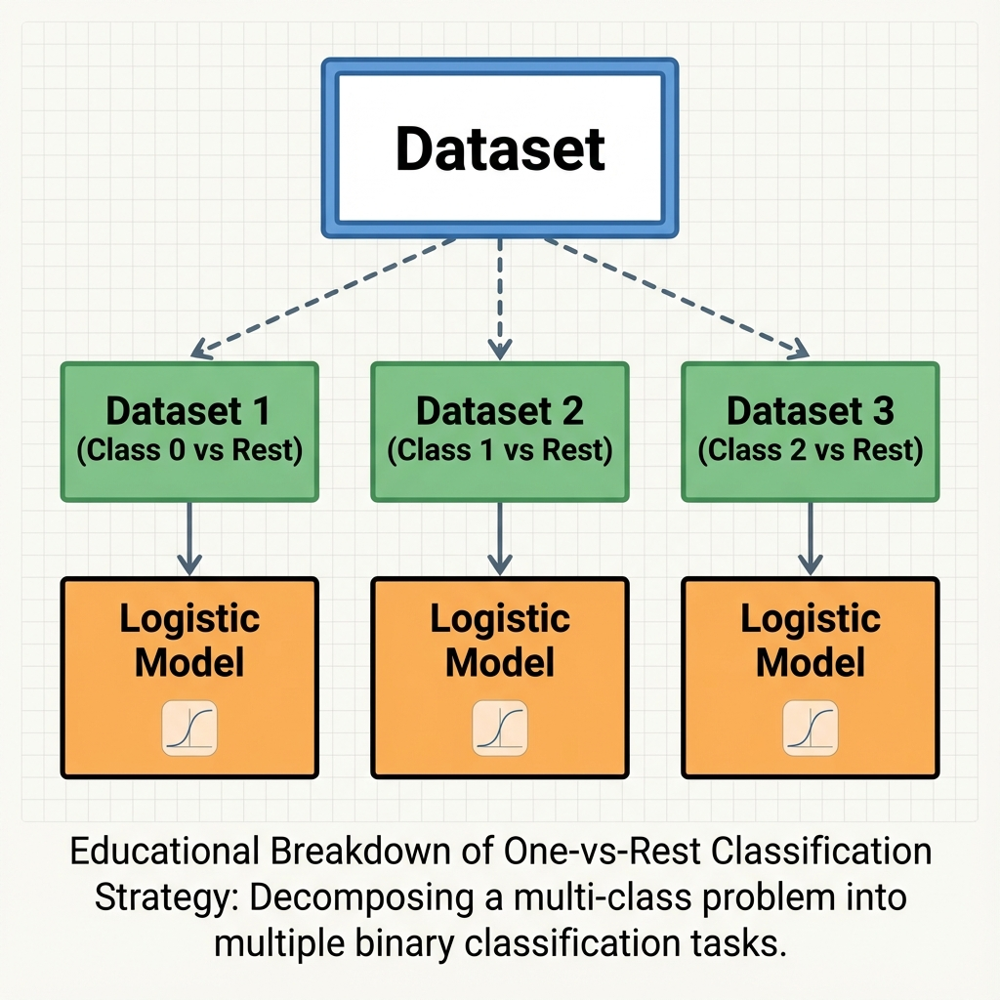

# Multiclass Logistic Regression (Softmax Regression)

> **Goal**: Extending Logistic Regression to predict $K$ classes (e.g., Dog, Cat, Rabbit) instead of just 2.

### 1. The Softmax Function
In Binary Classification, we used **Sigmoid** to get a probability between 0 and 1.
In Multiclass ($K > 2$), we use **Softmax**.

$$ \sigma(Z)_i = \frac{e^{Z_i}}{\sum_{j=1}^{K} e^{Z_j}} $$

*   **Input**: A vector of raw scores (logits) $Z = [z_1, z_2, \dots, z_k]$.
*   **Output**: A probability vector where $\sum P_i = 1$.
*   **Concept**: It exponentiates inputs (to make them positive) and normalizes them.

<!-- 
IMAGE_PROMPT: 
Type: Flow Diagram
Description: 
- Input Layer -> Hidden/Logit Layer (Z1, Z2, Z3).
- Softmax Block: Takes 3 inputs, outputs 3 probabilites (0.7, 0.2, 0.1).
- Highlight "Sum = 1".
Style: Neural Network style.
-->


---

### 2. Intuition: One-vs-Rest (OVR)
*Note: This is often how we "think" it works, even if the implementation differs.*

Imagine a dataset with 3 classes: Yes (0), No (1), Opt-out (2).
We can build **3 Binary Classifiers**:
1.  **Model 1**: Class 0 vs (1 & 2). ($w^{(0)}$)
2.  **Model 2**: Class 1 vs (0 & 2). ($w^{(1)}$)
3.  **Model 3**: Class 2 vs (0 & 1). ($w^{(2)}$)

**Prediction**:
*   Calculate $P(\text{Class } i)$ using Model $i$.
*   Pick the class with the highest probability/score.

> **Drawback**: This requires training $K$ separate models, which can be slow and computationally expensive.

<!-- 
IMAGE_PROMPT: 
Type: Tree Diagram (From Notes)
Description: 
- Root: "Dataset".
- Branches: Dataset 1 (Eq=0 vs Rest), Dataset 2 (Eq=1 vs Rest), Dataset 3 (Eq=2 vs Rest).
- Arrows pointing to 3 separate "Logistic Models".
Style: Educational breakdown.
-->



---

### 3. Actual Implementation: Multinomial (Softmax)
Instead of 3 separate binary models, we modify the **Loss Function** to handle all classes at once.

**Generalized Cross Entropy Loss**:
$$ L = - \frac{1}{m} \sum_{i=1}^{m} \sum_{k=1}^{K} Y_k^{(i)} \log(\hat{y}_k^{(i)}) $$

*   For each example, we sum the log-loss across all $K$ classes.
*   Since $Y$ is One-Hot Encoded (e.g., $[0, 1, 0]$), only the **Correct Class** term contributes to the loss (others are multiplied by 0).
*   This is the standard loss used in Deep Learning classifiers as well.

> **Decision Boundaries**: Even in Multiclass, the boundaries are **Linear** (Straight lines/Hyperplanes). They partition the feature space into convex regions.

<!-- 
IMAGE_PROMPT: 
Type: Graph (Decision Boundary)
Description: 
- 2D Scatter plot with 3 classes (Red, Blue, Green clusters).
- Straight lines separating them.
- Lines intersect at a central point.
- Label: "Linear Decision Boundaries".
Style: Geometric plot.
-->


---

### 4. Python Implementation

Sklearn's `LogisticRegression` handles this automatically.

```python
from sklearn.linear_model import LogisticRegression

# OVR (One-vs-Rest): Fits K binary models
# Good for: Simple interpretation, specific class focus
model_ovr = LogisticRegression(multi_class='ovr', solver='liblinear')

# Multinomial (Softmax): Fits 1 model with Softmax Loss
# Good for: Mutual exclusivity (e.g., Digit recognition)
model_softmax = LogisticRegression(multi_class='multinomial', solver='lbfgs')
```

### 5. Interview Questions

**Q1: Difference between OVR and Multinomial?**
*   **Ans**: OVR trains $K$ independent binary classifiers (good if classes are not mutually exclusive). Multinomial trains a single model minimizing the combined Cross-Entropy loss (better for mutually exclusive classes like Digits).

**Q2: Why do we use Softmax and not just divide by sum?**
*   **Ans**: Softmax uses exponentiation ($e^z$). This does two things:
    1.  Handles negative values (makes them positive).
    2.  Exaggerates differences: A slightly higher score gets a much higher probability ("Winner takes all" effect).

**Q3: Are decision boundaries still linear?**
*   **Ans**: Yes. Even with multiple classes, the boundary between any two classes is defined by where their scores are equal ($w_A^Tx = w_B^Tx$), which forms a linear hyperplane.
