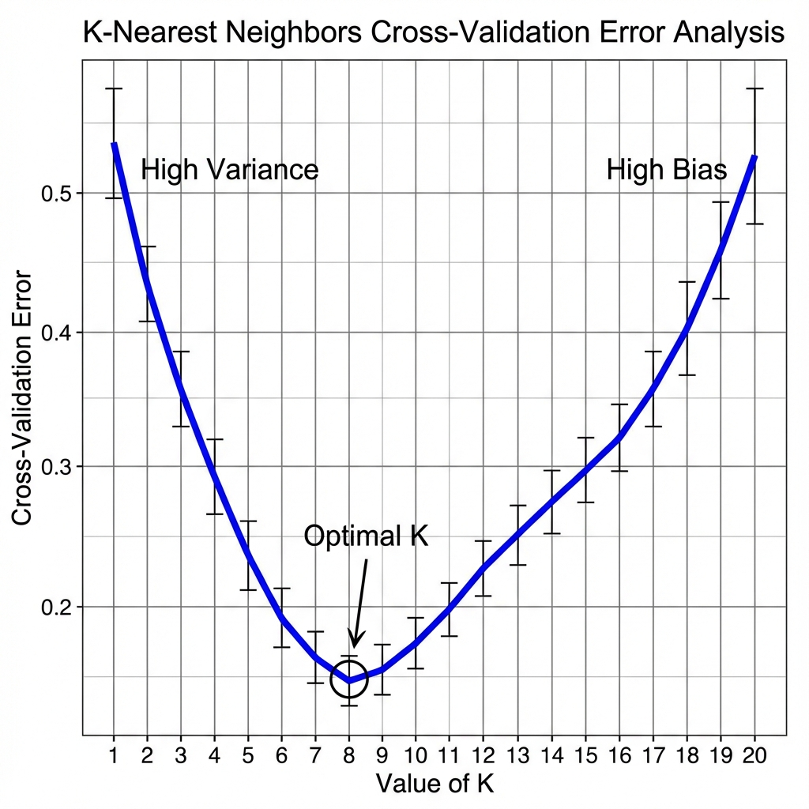

# K-Nearest Neighbors (KNN) - Algorithm & Math

### 1. The Algorithm Steps
For any new point $p$:
1.  **Calculate Distance**: Find the distance between $p$ and every point in the training set $D$.
2.  **Sort**: Sort the distances in ascending order.
3.  **Take Top K**: Select the top $K$ rows from the sorted array.
4.  **Majority Vote**:
    *   **Classification**: Return the Mode (Most frequent class) of the top $K$ points.
    *   **Regression**: Return the Mean (Average value) of the top $K$ points.

---

### 2. Distance Metrics
The choice of distance defines "similarity".

#### A. Euclidean Distance (L2 Norm)
The straight-line distance. Used by default.
$$ d(x, y) = \sqrt{\sum_{i=1}^{n} (x_i - y_i)^2} $$

#### B. Manhattan Distance (L1 Norm)
The "Taxi-cab" distance (grid-like).
$$ d(x, y) = \sum_{i=1}^{n} |x_i - y_i| $$

---

### 3. How to Select K?
The value of $K$ controls the Bias-Variance Tradeoff.

#### A. Heuristic Approach (The "Jugaad")
Take the square root of the number of data points ($n$).
$$ K = \sqrt{n} $$
*   Example: If $n=100$, try $K=10$.
*   **Tip**: Always choose an **Odd K** (e.g., 9 or 11) to avoid ties in voting (50-50 splits).

#### B. Experimental Approach (Cross-Validation) **[Recommended]**
Compare the error rate for different values of $K$.
*   Try: $K = [1, 3, 5, 7, 9, 11, ...]$
*   Plot **Error Rate vs K**.
    *   **Low K (e.g., 1)**: Overfitting. Captures noise.
    *   **High K (e.g., n)**: Underfitting. Predicts the constant majority.
    *   **Optimal K**: The "Goldilocks" zone with the lowest Validation Error.

<!-- 
IMAGE_PROMPT: 
Type: Line Plot
Description: 
- X-axis: Value of K (1 to 20).
- Y-axis: Cross-Validation Error.
- Curve shape: U-shaped (High error at K=1 due to variance, High error at K=20 due to bias).
- Optimal K is clearly marked at the bottom of the U.
Style: Scientific Plot.
-->

---

### 4. Visualizing the Decision Boundary (Surface)
How does KNN "see" the world?
*   **Algorithm**:
    1.  Plot the training data.
    2.  Create a **MeshGrid** (a dense grid of points covering the X-Y range).
    3.  Classify **every single point** on the meshgrid.
    4.  Color the grid based on the prediction.
    5.  Show the result as pixels/contours.
*   **Observations**:
    *   **K=1**: Fragmented, jagged islands. High Variance. Sensitive to outliers.
    *   **high K**: Smooth, simple boundaries. High Bias.

> **Tool**: Usually realized using `mlextend` library or custom `contourf` in plotting.
