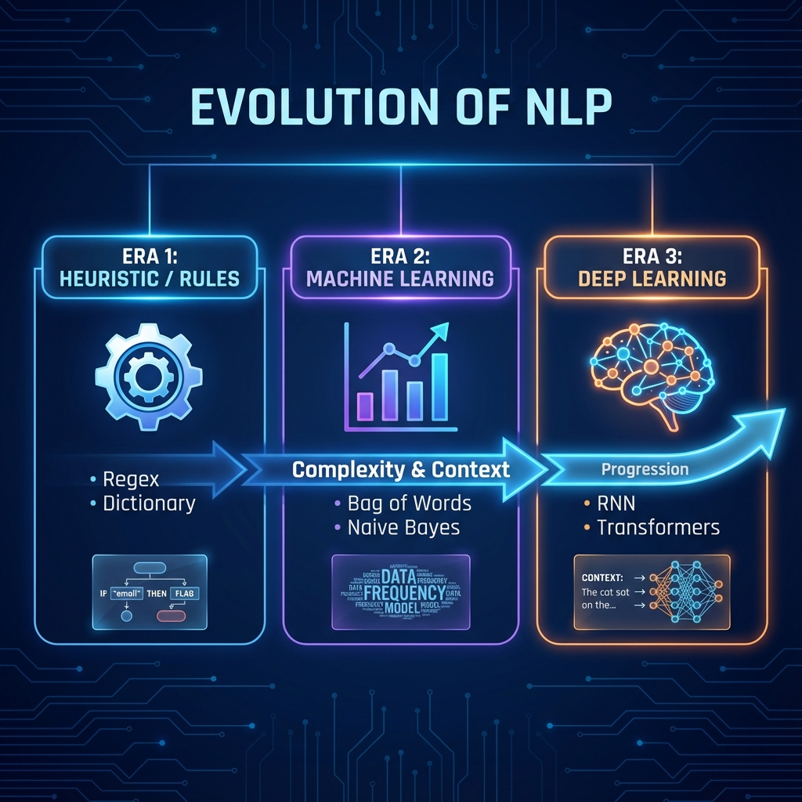
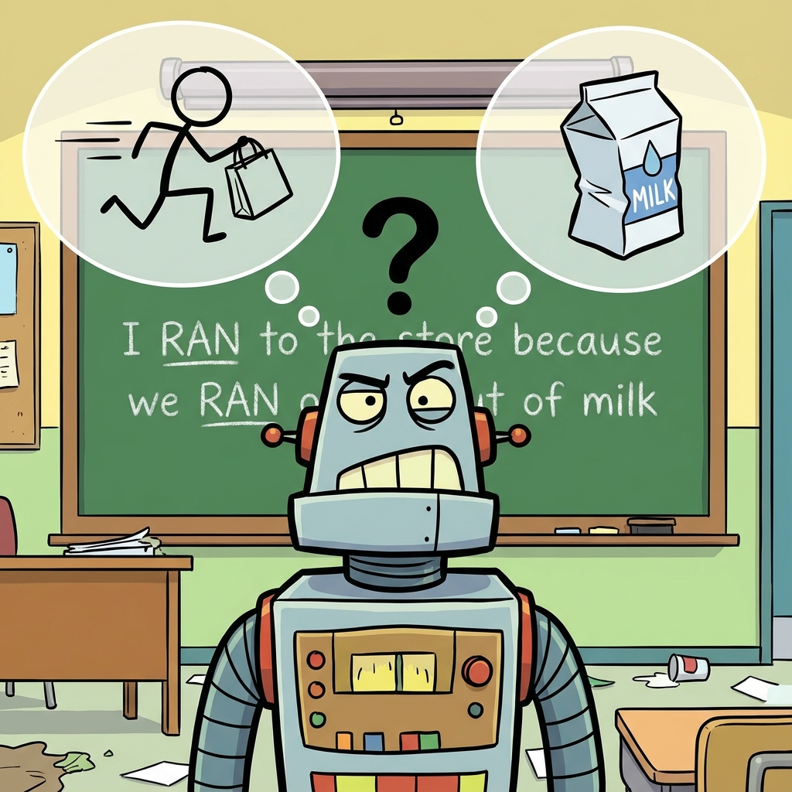

# Introduction to Natural Language Processing (NLP)

> **Definition**: NLP is a field of Artificial Intelligence that gives machines the ability to **read, understand, and derive meaning** from human languages.

---

### 1. What is Natural Language?
Natural Language is the way humans communicate with each other (e.g., English, Hindi, Spanish). It has evolved over thousands of years and is fundamentally different from **Formal Language** (like C++, Python, SQL) which has strict rules and no ambiguity.

### 2. Why is NLP Important?
Data comes in two forms:
1.  **Structured Data**: Excel sheets, SQL tables (Numbers, Categories). Easy for computers.
2.  **Unstructured Data**: Emails, Reviews, Videos, Audio, Social Media posts. **Difficult** for computers.

**Fact**: ~80% of the world's data is unstructured text. NLP allows us to unlock value from this massive chunk of data.

---

### 3. Real World Applications
Where is NLP used today?

1.  **Contextual Advertisements**: Targeted ads based on your search/chat history (not just keywords, but context).
2.  **Spam Filtering**: Gmail classifying emails as "Spam" or "Not Spam".
3.  **Smart Reply**: LinkedIn/Gmail suggesting "Great work!", "Thanks!" responses.
4.  **Social Media Analysis**:
    *   Removing adult/violent content automatically.
    *   **Opinion Mining**: Analyzing political sentiment or brand reputation.
5.  **Search Engines**: Google understanding "Apple" (Fruit) vs "Apple" (Company) based on query context.
6.  **Chatbots**: Customer support agents (Zomato, Swiggy, Bank bots).
7.  **Voice Assistants**: Siri, Alexa, Google Assistant.

---

### 4. Common NLP Tasks
NLP is a broad umbrella covering many specific tasks:

1.  **Text/Document Classification**: Classifying news into Sports/Tech/Politics.
2.  **Sentiment Analysis**: Positive/Negative/Neutral (Movie reviews).
3.  **Information Retrieval**: Fetching relevant documents (Google Search).
4.  **POS Tagging (Parts of Speech)**: Identifying Nouns, Verbs, Adjectives.
5.  **Language Detection & Machine Translation**: Google Translate.
6.  **Conversational Agents**: Siri, Alexa.
7.  **Knowledge Graph & QA Systems**: "Who is the PM of India?" -> Extracting answer from web.
8.  **Text Summarization**: Shortening a long research paper into a paragraph.
9.  **Topic Modeling**: Finding abstract topics in a collection of documents (LDA).
10. **Text Generation**: Autocomplete, ChatGPT, Writing poems.
11. **Spell Check / Grammar Correction**: Grammarly.
12. **Text Parsing**: Understanding sentence structure (Subject-Object relations).
13. **Speech to Text**: Transcribing YouTube videos.

---

### 5. Approaches to NLP (The Evolution)

We can divide NLP history into three main eras:

#### A. Heuristic Methods ("Jugaad")
*   **Logic**: Rule-based approaches using Regular Expressions (Regex), WordNet, and manual dictionaries.
*   **Examples**:
    *   Finding email addresses using specific patterns (`@` symbol).
    *   Removing suffixes (`ing`, `ed`) manually.
*   **Pros**: Quick to implement, accurate for specific simple tasks.
*   **Cons**: Fails on complex sentences, sarcasm, or new words.

#### B. Machine Learning Based Methods
*   **Logic**: Convert **Text $\to$ Numbers (Vectorization)** and then apply statistical models.
*   **Algorithms**: Naive Bayes, Logistic Regression, SVM, LDA, Hidden Markov Models (HMM).
*   **Pros**: Can learn from data, better generalization than rules.
*   **Cons**: Loses sequential information (e.g., "Dog bites Man" vs "Man bites Dog" might look same in Bag of Words).

#### C. Deep Learning Based Methods (State of the Art)
*   **Logic**: Uses Neural Networks to generate features automatically.
*   **Big Advantage**: **Sequence of text is retained**. The order of words matters.
*   **Algorithms**:
    *   **RNN (Recurrent Neural Networks)**
    *   **LSTM / GRU** (Long Short Term Memory)
    *   **CNN** (Convolutional Neural Networks for text)
    *   **Transformers** (The revolution: BERT, GPT, T5)
    *   **Autoencoders**

---

### 6. Challenges in NLP
Why is NLP hard? Because human language is messy.

1.  **Ambiguity**:
    *   "I saw a bat." (The animal? Or the cricket bat?)
2.  **Contextual Words**: The meaning depends on the sentence.
    *   *Example*: "I **ran** to the store because we **ran** out of milk."
    *   First "ran": Physical action (running).
    *   Second "ran": State of depletion (empty).
3.  **Colloquialisms & Slang**: "Gonna", "Wanna", "Lit", "GOAT". Formal rules fail here.
4.  **Synonyms**: "Big", "Large", "Huge", "Gigantic" mean roughly the same but are used differently.
5.  **Irony, Sarcasm, & Tonal Difference**:
    *   "Great weather!" (Could mean it's raining heavily if said sarcastically). Machines struggle to detect this without voice tone.
6.  **Spelling Errors**: "Hllo", "Helo", "Hlo" all mean "Hello".
7.  **Creativity**: Poetry, Jokes, Metaphors ("Time is money").
8.  **Diversity in Languages**: thousands of languages, dialects, scripts (Left-to-Right, Right-to-Left).

---

### 7. Exercise
*   **Write a short blog post about what NLP is and its evolution.**

<!--
IMAGE_PROMPT:
Type: Infographic timeline
Description:
- A timeline showing the "Evolution of NLP".
- Era 1: Heuristic/Rules (Regex, Dictionary). Icon: Gear/Rulebook.
- Era 2: Machine Learning (Naive Bayes, SVM). Icon: Statistical Graph.
- Era 3: Deep Learning (RNN, Transformers). Icon: Neural Network Brain.
- Show "Context/Sequence" as the key bridge between ML and DL.
Style: Tech Roadmap.
-->

<!--
IMAGE_PROMPT:
Type: Conceptual Illustration
Description:
- Visualizing "Ambiguity" in NLP.
- A cartoon scene showing a computer confused by the sentence "I ran to the store because we ran out of milk".
- Two thought bubbles for the computer: one thinking of a "Running Person", the other thinking of an "Empty Milk Carton".
Style: Fun/Educational Sketch.
-->

