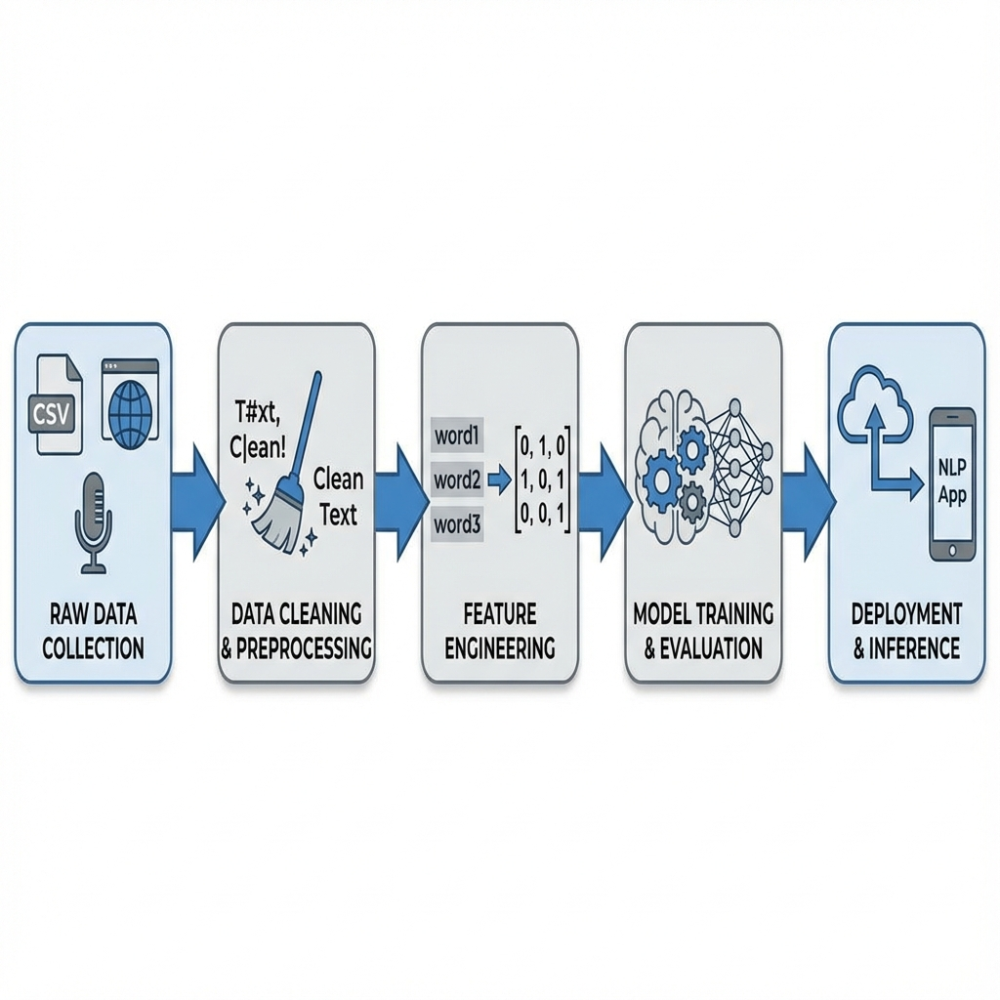
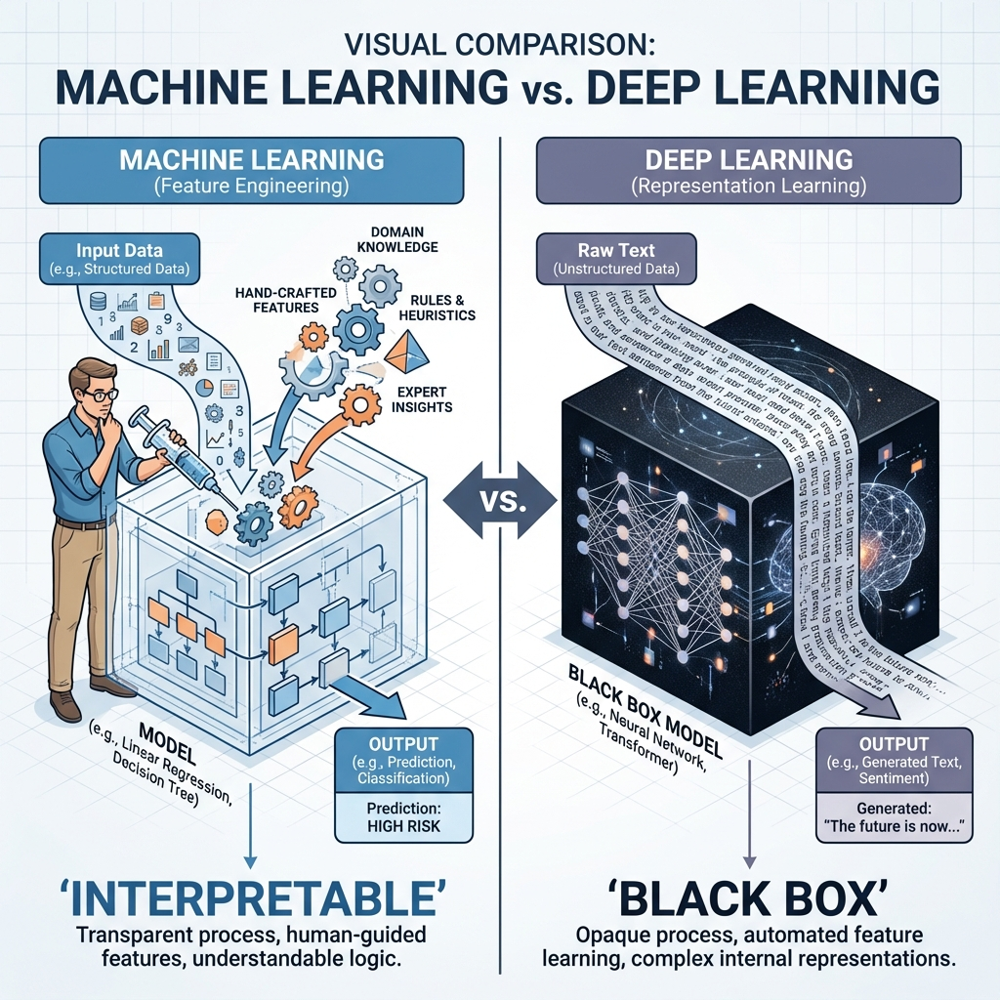

# The NLP Pipeline

> **Concept**: Only 10-15% of an NLP project is actual modeling. The rest is the "Pipeline" — the systematic process of moving from raw data to a deployed solution.

---
## NLP Pipeline
1. Data Acquisition
2. Data Preparation
    - text cleanup
    - basic text preprocessing
    - advanced text preprocessing
3. Feature Engineering
4. Modeling
    - Model Building
    - Model Evaluation
5. Deployment
    - Deployment
    - Monitoring
    - Update Strategy
 
---
### Points to remember
- This pipeline is not universal. It can be modified based on the problem statement.
- DL pipelines are slightly different.
- Pipeline is non-linear.
---

<!--
IMAGE_PROMPT:
Type: Flowchart
Description:
- A horizontal pipeline flow.
- Step 1: Raw Data icons (CSV, Web, Mic).
- Step 2: Cleaning (Broom icon cleaning text).
- Step 3: Feature Engineering (Text converting to [0,1,0] Matrix).
- Step 4: Model (Gear/Brain).
- Step 5: Deployment (Cloud/Phone).
- Show logical arrows connecting them.
Style: Professional Engineering Diagram.
-->



### 1. Data Acquisition
Where does the data come from?

#### Scenario A: Data is Available
1.  **Direct Source**: CSV files.
2. **Running Database**: (Data Engineers are needed to extract the data (Data Warehouse)) -  SQL Database, Company logs.
3.  **Less Data?**: Use **Data Augmentation** techniques:
    *   **Synonym Replacement**: "The movie was *good*" $\to$ "The movie was *great*".
    *   **Bigram Flip**: "I *go to* school" $\to$ "I *to go* school" (Use carefully).
    *   **Back Translation**: English $\to$ French $\to$ English (Creates variations).
    *   **Adding Noise**: Intentionally adding typos to make model robust.

#### Scenario B: Third Party Data
1.  **Public Datasets**: Kaggle, HuggingFace, UCI.
2.  **Web Scraping**: Using `BeautifulSoup` or `Scrapy` to extract text from websites.
    ```python
    import requests
    from bs4 import BeautifulSoup
    
    url = "https://example.com/blog"
    response = requests.get(url)
    soup = BeautifulSoup(response.content, 'html.parser')
    text = soup.get_text() # Extract raw text from HTML
    ```
3.  **APIs**: Twitter API, Reddit API, News API.
4.  **PDF/Images**: Using OCR (Tesseract) to extract text from scanned documents.
5.  **Audio**: Transcribing call logs (Speech-to-Text).

#### Scenario C: No Data
*   The most challenging scenario. Requires "Jugaad" (Heuristics) or manual annotation/labeling tools (Propdigy, LabelStudio).

---

### 2. Data Preparation
Cleaning text to make it usable.

#### A. Basic Cleanup
*   **HTML Tags**: Removing `<br>`, `<div>` from web-scraped data (Regex).
    ```python
    import re
    text = "<div>Hello World!<br></div>"
    clean_text = re.sub(r'<.*?>', '', text) # output: "Hello World!"
    ```
*   **Emojis**: Encoding correctly (UTF-8) or removing extraneous ones.
    ```python
    text = "Hello \U0001F600"
    text = text.encode('utf-8').decode('utf-8') # Ensure proper encoding
    ```
*   **Spelling Check**: Correcting typos ("fat finger typing") using libraries like `TextBlob`.
    ```python
    import textblob
    from textblob import TextBlob
    incorrect_text = "I love macine learnin"
    corrected_text = TextBlob(incorrect_text).correct()
    print(corrected_text) # "I love machine learning"
    ```

#### B. Basic Preprocessing
*   **Tokenization**: Splitting paragraphs $\to$ Sentences $\to$ Words.
    ```python
    import nltk
    nltk.download('punkt')
    from nltk.tokenize import word_tokenize, sent_tokenize
    
    text = "Hello NLP. It is fun."
    print(word_tokenize(text)) # ['Hello', 'NLP', '.', 'It', 'is', 'fun', '.']
    ```
*   **Case Folding**: Converting everything to lowercase (Caution: "Apple" company vs "apple" fruit).
*   **Stop-words Removal**: Removing "is, the, a, on" (Low meaning words).
*   **Stemming/Lemmatization**: Converting "running, ran" $\to$ "run".

#### C. Advanced Preprocessing
*   **POS Tagging**: Identifying Nouns, Verbs to understand context.
*   **Parsing**: Understanding sentence structure (Dependency Parsing).
*   **Coreference Resolution**: Figuring out who "he" or "it" refers to in a paragraph.

---

### 3. Feature Engineering
Computers understand numbers, not text. We must convert **Text $\to$ Vectors**.

| Text | Sentiment | $\to$ | Count_Positive | Count_Negative | Sentiment (Target) |
| :--- | :--- | :--- | :--- | :--- | :--- |
| "Good" | 1 | $\to$ | 1 | 0 | 1 |
| "Bad" | 0 | $\to$ | 0 | 1 | 0 |

#### Techniques
1.  **Bag of Words (BoW)** / CountVectorizer.
2.  **TF-IDF** (Term Frequency - Inverse Document Frequency).
3.  **One-Hot Encoding**.
4.  **Word2Vec / Embeddings** (Capturing semantic meaning).

    ```python
    # Bag of Words Example
    from sklearn.feature_extraction.text import CountVectorizer
    corpus = ["I love NLP", "NLP is fun"]
    vectorizer = CountVectorizer()
    X = vectorizer.fit_transform(corpus)
    print(X.toarray()) 
    # Output: [[0 1 1], [1 1 0]] (Indices match vocabulary)
    ```

#### ML vs DL Approach
*   **Machine Learning**: requires Domain Knowledge to create manual features (e.g., "length of email", "number of caps"). **Interpretable**.
*   **Deep Learning**: The model learns features itself. Domain knowledge is less critical, but it's a **Black Box** (Hard to interpret).

<!--
IMAGE_PROMPT:
Type: Comparison Table Visual
Description:
- A visual comparison of "Machine Learning vs Deep Learning" in NLP.
- Left Side (ML): Human injecting "Domain Knowledge" features -> Model -> Output. Label: "Interpretable".
- Right Side (DL): Raw Text -> Model (Black Box) learns features -> Output. Label: "Black Box".
Style: Clean architectural comparison.
-->



---

### 4. Modeling
Choosing the brain for the task.

#### Approaches
1.  **Heuristics**: If you have very little data (Regex rules).
2.  **Machine Learning**: Naive Bayes, SVM, Random Forest (Moderate data).
3.  **Deep Learning**: RNNs, Transformers (Huge data).
4.  **Transfer Learning**: Using pre-trained BERT/GPT and fine-tuning (Smartest modern approach).
5.  **Cloud APIs**: Google Cloud NLP, AWS Comprehend (No coding, just pay-per-use).

> **Rule of Thumb**:
> *   **Less Data** $\to$ Heuristics.
> *   **More Data** $\to$ ML Algorithms.
> *   **Huge Data** $\to$ Deep Learning.

---

### 5. Evaluation
How do we know it works?

#### A. Intrinsic Evaluation (Technical)
*   Metrics: Accuracy, Precision, Recall, F1-Score, Perplexity.
*   "My model has 95% accuracy on the test set."

#### B. Extrinsic Evaluation (Business)
*   Business Settings: Does it actually solve the problem?
*   Example (Text Suggestion): "How many times did the user *actually click* the suggestion?"
*   Example (Spam Filter): "How many user complaints about missed spam?"

---

### 6. Deployment
Taking it to production.

1.  **Deploy**:
    *   **API / Microservice**: Flask/FastAPI endpoint.
    *   **Bot Integration**: WhatsApp Bot, Slack Bot.
2.  **Monitoring**:
    *   Dashboards (Grafana) to track latency and accuracy.
    *   **Model Drift**: Is the model performance degrading over time?
3.  **Update Strategy**:
    *   **Offline Training**: Retrain model every week/month on new data.
    *   **Online Training**: Model learns incrementally on the fly (Risky but fast).

---

### 7. Exercise: The Quora Challenge

**Problem Statement:** On Quora, many people ask the same question in different ways (e.g., "How to learn ML?" vs "Best way to start Machine Learning?"). We need to **identify duplicate questions** to merge answers.

**Design the Pipeline:**

1. Data Acquisition 
* From where would you acquire the data?
2. Text Preparation
* What kind of cleaning steps would you perform?
* What text preprocessing step would you apply?
* Is advanced text preprocessing required?
3. Feature Engineering
* What kind of features would you create?
4. Modelling
* What algorithm would you use to solve the problem at hand?
* What intrinsic evaluation metrics would you use?
* What extrinsic evaluation metrics would you use?
5. Deployment
* How would you deploy your solution into the entire product?
* How and what things will you monitor?
* What would be your model update strategy?
