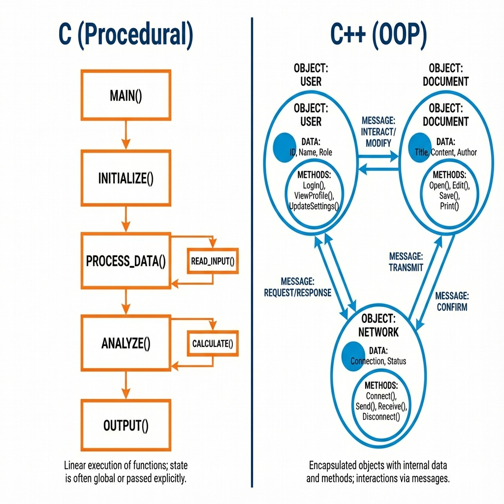

# 1. Introduction to Language

## What is C++?
*   **Definition**: A cross-platform language capable of creating high-performance applications. It is an extension of the C language.
*   **Paradigm**: **Multi-paradigm** language – supports **Procedural**, **Object-Oriented**, and **Generic** programming.
*   **Level**: Often called a **Mid-level** language because it combines high-level features (abstraction, classes) with low-level manipulation (pointers, memory management).
*   **Efficiency**: Gives programmers high control over system resources and memory.

## Why use C++?
*   **Performance**: One of the fastest languages, close to hardware execution speed.
*   **System Programming**: Ideal for Operating Systems, Drivers, Kernels.
*   **Game Development**: widely used in game engines (Unreal Engine) due to control over hardware.
*   **Resource Constrained Systems**: Effective for embedded systems.

## C vs C++
| Feature | C | C++ |
| :--- | :--- | :--- |
| **Type** | Procedural | Multi-paradigm (Procedural + OOP) |
| **Encapsulation** | No (Data is global/local) | Yes (Classes, Access Specifiers) |
| **Memory Management** | `malloc()` / `free()` | `new` / `delete` |
| **Function Overloading** | No | Yes |
| **References** | No (Pointers only) | Yes |
| **Input/Output** | `stdio.h` (`printf`/`scanf`) | `iostream` (`cin`/`cout`) |
| **Strings** | Content is `char` array | Content is `std::string` object |

<!--
    IMAGE GENERATION PROMPT:
    A split comparison diagram. Left side labeled "C (Procedural)" showing a linear flow of functions. Right side labeled "C++ (OOP)" showing Objects encapsulation data and methods interacting.
    Visual style: Clean, technical, minimal colors (Blue for C++, Orange for C).
    Purpose: Visualizing the paradigm shift from functions to objects.
-->

---

## Interview Questions

### Q1: What are the main differences between C and C++?
**Answer**:
*   **Paradigm**: C is procedural, whereas C++ is object-oriented.
*   **Security**: C++ supports encapsulation (Data Hiding), C does not.
*   **Namespace**: C++ has namespaces to avoid name collisions; C does not.
*   **Memory operations**: C++ uses operators (`new`, `delete`) which call constructors/destructors; C uses functions (`malloc`, `free`) which do not.

### Q2: Is C++ a superset of C?
**Answer**:
*   **Strictly speaking**: No, but **practically**: Yes.
*   Most C code compiles in C++ with minor adjustments, but C++ introduces stronger type checking and some C-valid code (like implicit void* conversion) is invalid in C++.

> **Follow-up**: Give an example of C code that fails in C++.
> **Answer**: `int *p = malloc(10);` works in C (implicit void conversion). In C++, you must cast: `int *p = (int*)malloc(10);`.

### Q3: What is the difference between a Compiler and an Interpreter?
**Answer**:
*   **Compiler** (C++): Translates the entire source code into machine code *before* execution. Result is an executable file. Faster execution.
*   **Interpreter** (Python): Translates code line-by-line *during* execution. Slower execution, but platform independent source.
