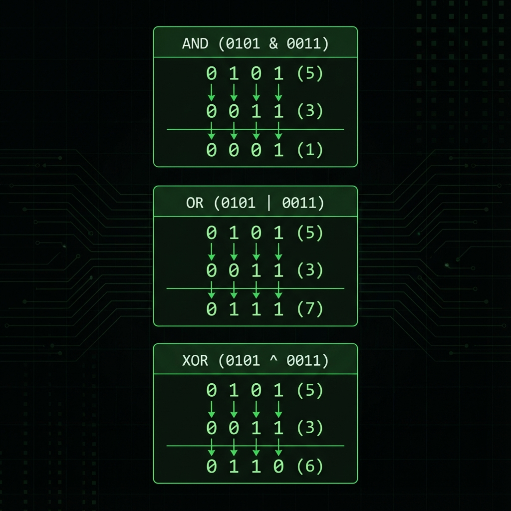

# 3. Basic Operations

## Arithmetic Operators
These perform common mathematical operations.
*   `+` (Add), `-` (Subtract), `*` (Multiply), `/` (Divide), `%` (Modulus).
*   **Integer Division**: `5 / 2` is `2` (truncates decimal). `5.0 / 2.0` is `2.5`.
*   **Increment/Decrement**: `++i` (Pre-increment: increments **then** returns value) vs `i++` (Post-increment: returns value **then** increments).

## Logical Operators
Used to combine conditional statements.
*   `&&` (AND): True if **both** are true.
*   `||` (OR): True if **at least one** is true.
*   `!` (NOT): Reverses the boolean state.
*   **Short-Circuit Evaluation**:
    *   `A && B`: If `A` is false, `B` is **not executed**.
    *   `A || B`: If `A` is true, `B` is **not executed**.

## Bitwise Operators
Operate on bit-level representations (essential for systems coding & performance).
| Operator | Name | Description | Example (A=5 `0101`, B=3 `0011`) |
| :--- | :--- | :--- | :--- |
| `&` | AND | 1 if both bits are 1 | `0101 & 0011` = `0001` (1) |
| `|` | OR | 1 if either bit is 1 | `0101 | 0011` = `0111` (7) |
| `^` | XOR | 1 if bits are different | `0101 ^ 0011` = `0110` (6) |
| `~` | NOT | Inverts all bits | `~0101` = `1010` (In signed logic, varies) |
| `<<` | Left Shift | Shifts bits left (Multiply by 2^n) | `5 << 1` = `1010` (10) |
| `>>` | Right Shift | Shifts bits right (Divide by 2^n) | `5 >> 1` = `0010` (2) |

<!--
    IMAGE GENERATION PROMPT:
    A clear diagram showing Bitwise operations (AND, OR, XOR) on two binary numbers.
    Top row: 0101 (5), Middle row: 0011 (3), Bottom row: Result.
    Arrows connecting corresponding bits.
    Visual style: Digital, matrix-style green/black or clean dark mode style.
-->


---

## Interview Questions

### Q1: What is the difference between `++i` and `i++`?
**Answer**:
*   `++i` (Pre): Increments the variable immediately and returns the **new** value.
*   `i++` (Post): Creates a **temporary copy** of the variable, increments the original, and returns the **copy** (old value).
*   **Performance**: In complex objects (iterators), `++i` is generally faster because `i++` generally involves creating a temporary copy.

### Q2: Explain Short-Circuiting with an example.
**Answer**:
*   It's an optimization where the second argument is ignored if the result is already determined.
*   **Example**: `if (ptr != nullptr && ptr->value == 10)`
    *   If `ptr` is `NULL`, the first part is false. The system stops there and **does NOT** check `ptr->value`. This prevents a crash (Segmentation Fault).

### Q3: How do you check if a number is even or odd using bitwise operators?
**Answer**:
*   Check the Least Significant Bit (LSB).
*   `if ((n & 1) == 0)` -> **Even** (LSB is 0).
*   `if ((n & 1) == 1)` -> **Odd** (LSB is 1).
*   *Why?* Bitwise AND is faster than Modulo (`% 2`).

### Q4: How do you swap two numbers without a temporary variable?
**Answer**:
Using XOR operator:
```cpp
a = a ^ b;
b = a ^ b; // wraps around to original 'a'
a = a ^ b; // wraps around to original 'b'
```
*Note: This is a classic trick but rarely used in production due to lack of readability.*
