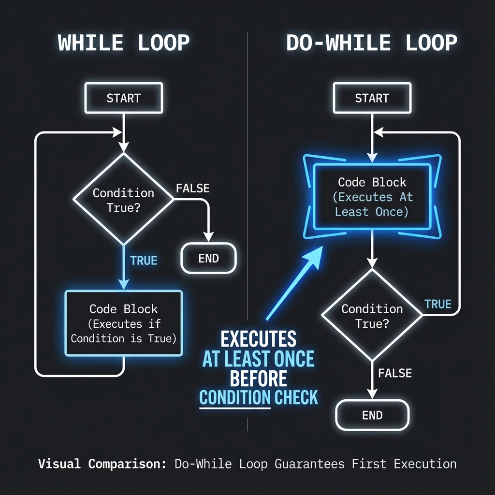

# 4. Control Flow & Statements

## Conditional Statements
*   `if`, `else if`, `else`: Basic branching.
*   **Switch Case**: Faster than multiple `if-else` (using jump tables). Works only on **integers** and **enums**.
    *   **Fallthrough**: Execution continues to next case unless `break` is used.
    *   `[[fallthrough]]` attribute (C++17) explicitly marks intentional fallthrough.

## Constexpr If (C++17)
Evaluates condition at **Compile Time**. If false, the discard branch is **not even compiled** (useful for templates).
```cpp
if constexpr (std::is_same_v<T, int>) {
    // Compiled only if T is int
}
```

## Loops
*   `for`: Standard loop. `for (init; condition; increment)`.
*   `while`: Runs while condition is true. Check happens **before** loop body.
*   `do-while`: Runs **at least once**. Check happens **after** loop body.
*   **Range-based for loop** (C++11): Iterates over containers/arrays.
    ```cpp
    std::vector<int> nums = {1, 2, 3};
    for (int n : nums) { ... } // Copies each element
    for (const auto& n : nums) { ... } // Efficient (Ref + Const)
    # 
    ```

## Jump Statements
*   `break`: Exits the current loop or switch case.
*   `continue`: Skips remainder of current iteration and proceeds to next.
*   `goto`: Jumps to a labeled statement. **Avoid** (spagetti code).

<!--
    IMAGE GENERATION PROMPT:
    A flowchart comparing "While Loop" (Condition -> Code -> Loop) vs "Do-While Loop" (Code -> Condition -> Loop).
    Visual style: Flowchart nodes, distinct shape for decision (diamond).
-->


---

## Interview Questions

### Q1: When should you use `switch` over `if-else`?
**Answer**:
*   **Performance**: compilers often optimize `switch` into a **jump table** (O(1) lookup), whereas `if-else` chains are linear (O(n)).
*   **Readability**: Cleaner for checking one variable against many constant values.
*   **Constraint**: `switch` only works with integral types (int, char, enum), not strings or objects.

### Q2: What is the difference between `break` and `continue`?
**Answer**:
*   `break`: Terminates the **entire** loop immediately.
*   `continue`: Terminates only the **current iteration** and jumps to the next iteration check.

### Q3: Why is `goto` discouraged?
**Answer**:
*   It breaks structural programming logic, making code hard to follow ("Spaghetti Code").
*   It complicates resource management (might bypass destructor calls or variable initialization).
*   **Exception**: Sometimes used in C (Linux Kernel) for unified error handling cleanup, but in C++ RAII is preferred.

### Q4: In a range-based for loop, why use `const auto&`?
**Answer**:
*   `for (auto x : vec)`: Copies each element. Slow for large objects.
*   `for (auto& x : vec)`: Refers to original element. Good for modifying.
*   `for (const auto& x : vec)`: Refers to original element (Fast) but prevents modification (Safe).
