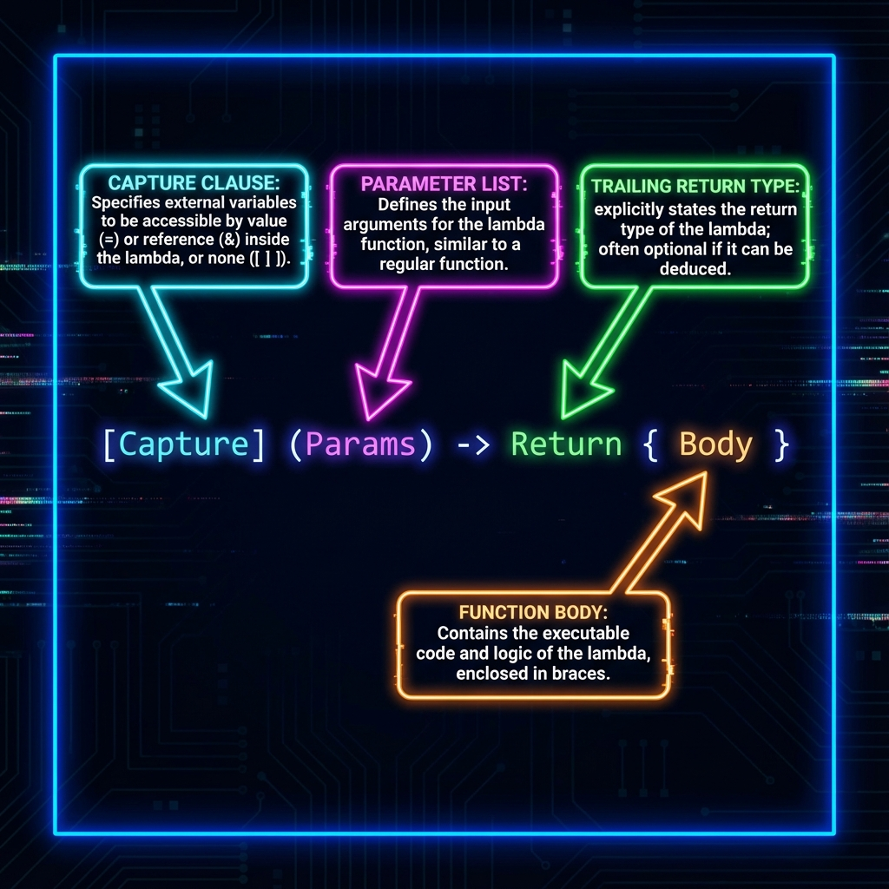

# 5. Functions

## Function Concepts
*   **Function Overloading**: Multiple functions with the same name but different parameters (type, count, or order).
    *   **Mechanism**: Compiler generates unique internal names (e.g., `_Z3fooii` vs `_Z3foodd`) known as **Name Mangling**.
    *   **Resolution Rules**: Exact Match > Promotion -> Standard Conversion -> User-Defined Conversion.
    *   *Note*: Return type purely is **NOT** enough to distinguish overloads.
*   **Static Polymorphism**: Using Overloading and Templates to decide behavior at compile time.
    *   **Pros**: No runtime overhead (v-table lookup excluded).
    *   **Cons**: Slower compile times, larger binary size (code duplication).

## Operator Overloading
Allows custom behavior for standard operators (`+`, `-`, `<<`, `[]`, `()`, `->`) for user-defined types.
*   **Syntax**: `ReturnType operatorOp(Parameters) { ... }`
*   **Functors**: Overloading `operator()` allows objects to be invoked like functions (Function Objects).
*   **Restrictions**:
    *   Cannot create new tokens (e.g., `**`).
    *   Cannot change precedence or arity (operand count).
    *   Cannot overload: `.` (dot), `.*`, `::`, `?:`, `sizeof`.

## Lambdas (Anonymous Functions)
Introduced in C++11. Useful for callbacks and STL algorithms.
*   **Syntax**: `[capture](params) mutable exception -> ret { body }`
*   **Capture Clause `[]`**:
    *   `[=]`: Capture all local vars by **value** (Read-Only by default).
    *   `[&]`: Capture all local vars by **reference** (Read-Write).
    *   `[this]`: Capture class member access.
*   **`mutable` keyword**: Allows modifying variables captured by *value* inside the lambda (effectively removes `const` from the internal operator()).
*   **Generic Lambdas (C++14)**: Use `auto` in parameters (e.g., ` { return x + y; }`).

## `std::function` (Type Erasure)
A wrapper that can store *any* callable target (function, lambda, functor) with a specific signature.
*   **Syntax**: `std::function<int(int, int)> func =  { return a + b; };`
*   **Cost**: Heavy. Often requires heap allocation and virtual-like indirect call overhead. Use only when you need to store different callables in a container.

<!--
    IMAGE GENERATION PROMPT:
    A syntax diagram of a C++ Lambda expression.
    Breakdown: [Capture] (Params) -> Return { Body }.
    Arrows pointing to each part explaining what it does.
    Visual style: Code-highlighting style, dark background, neon accents for labels.
-->

---

## Interview Questions

### Q1: What is the difference between Function Overloading and Overriding?
**Answer**:
*   **Overloading**: Same name, different params, same scope. Resolved at **Compile Time** (Static Binding). Uses Name Mangling.
*   **Overriding**: Same name, same params, **Derived Class**. Used with `virtual` functions. Resolved at **Runtime** (Dynamic Binding) via V-Table.

### Q2: Can we overload functions based on return type alone? Why?
**Answer**:
*   **No.** C++ allows ignoring return values.
*   *Snippet*: `foo();`
*   If you had `int foo()` and `void foo()`, the compiler cannot deduce which one you intended to call just from the call site. It leads to ambiguity.

### Q3: What is the overhead of a Lambda?
**Answer**:
*   **Zero overhead** if it doesn't capture anything (compiles to a raw function pointer).
*   **Minimal overhead** if it captures variables (compiles to a small struct/class with member variables holding the captures).
*   It is generally **faster** than `std::function` (which may allocate memory) and often faster than function pointers (easier for compiler to inline).

### Q4: Explain `inline` functions and `__forceinline`.
**Answer**:
*   `inline`: **Request** to compiler to copy function body to call site. Replaces call overhead with code size.
*   `__forceinline` (MSVC) / `__attribute__((always_inline))` (GCC): **Command** to force inlining even if compiler thinks it's a bad idea.
*   **Limit**: Virtual functions or recursive functions typically cannot be inlined.

### Q5: What is the "Most Vexing Parse"?
**Answer**:
*   An ambiguity where C++ interprets a variable declaration as a function declaration.
*   *Code*: `Time t(TimeKeeper());` -> Declares a function `t` returning `Time`, taking a function pointer.
*   *Fix*: Use uniform initialization (braces): `Time t{TimeKeeper()};`
