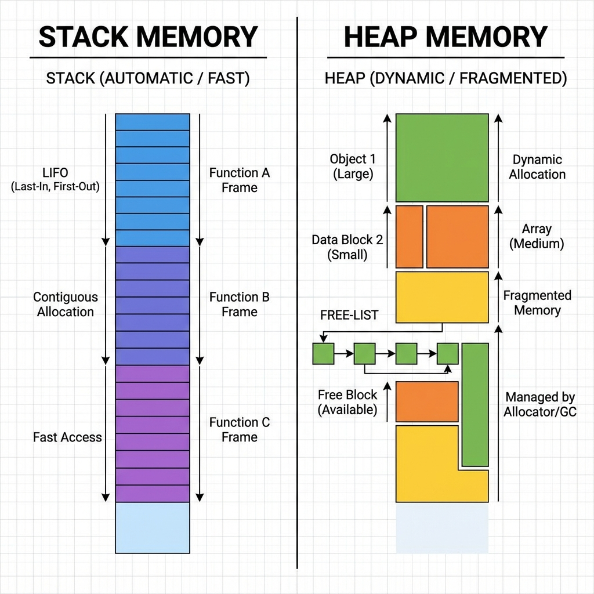
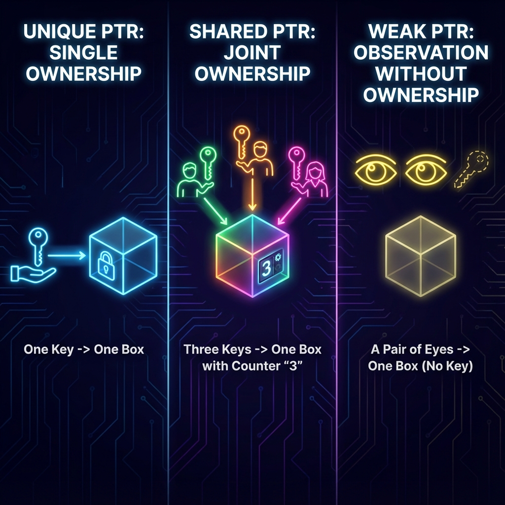

# 7. Pointers, References & Memory

## Pointers vs References
| Feature | Pointer (`int*`) | Reference (`int&`) |
| :--- | :--- | :--- |
| **Nullability** | Can be `nullptr` | **Must** be bound to valid object |
| **Reassignable** | Yes (can point closer to other data) | No (bound at initialization forever) |
| **Address** | Has its own memory address | Shares address of referent (Alias) |
| **Syntax** | Dereference with `*`, access with `->` | Access like normal variable |

### Syntax Comparison
```cpp
int x = 10;
int y = 20;

// Pointer
int* ptr = &x;  // stored address of x
*ptr = 15;      // changes x to 15
ptr = &y;       // ptr now points to y

// Reference
int& ref = x;   // ref is an alias for x
ref = 30;       // changes x to 30
// ref = y;     // LOGICAL ERROR: this assigns value of y (20) to x, does NOT rebind ref
```

## Memory Model
*   **Stack**:
    *   **Scope**: Automatic variables. LIFO structure.
    *   **Speed**: Extremely fast (single CPU instruction to move stack pointer).
    *   **Limit**: Small (e.g., 1MB-8MB). Deep recursion causes **Stack Overflow**.
*   **Heap** (Free Store):
    *   **Scope**: Manually managed (`new`/`delete`).
    *   **Speed**: Slower allocation (must find contiguous block, potential fragmentation).
    *   **Limit**: Limited by Virtual Memory/RAM.
*   **Static/Global**: Initialized at startup, lives until termination.
*   **Code/Text**: Read-only executable instructions.

<!--
    IMAGE GENERATION PROMPT:
    A split diagram showing Stack vs Heap.
    Stack: Tightly packed contiguous blocks, growing downwards, labeled "Automatic/Fast".
    Heap: Scattered blocks of varying sizes, managed by a free-list, growing upwards, labeled "Dynamic/Fragmented".
    Visual style: Computer Science memory layout schematic.
-->


## Smart Pointers (RAII)
Included in `<memory>`. They wrap raw pointers to handle cleanup automatically.

### 1. `std::unique_ptr`
*   **Ownership**: Exclusive. Cannot be copied, only moved.
*   **Use Case**: Default choice for most object creation.
```cpp
std::unique_ptr<int> p1 = std::make_unique<int>(10);
// std::unique_ptr<int> p2 = p1; // ERROR: Copy deleted
std::unique_ptr<int> p2 = std::move(p1); // OK: p1 is now empty (nullptr)
```

### 2. `std::shared_ptr`
*   **Ownership**: Shared. Object dies when *last* shared_ptr dies.
*   **Control Block**: Thread-safe ref-count.
```cpp
std::shared_ptr<int> p1 = std::make_shared<int>(10);
std::shared_ptr<int> p2 = p1; // Count = 2
p1.reset(); // Count = 1 (Object still alive)
// p2 goes out of scope -> Count = 0 -> Object Deleted
```

### 3. `std::weak_ptr`
*   **Ownership**: None. Watches a `shared_ptr` without increasing count.
*   **Use Case**: Caching, Observer patterns, preventing Reference Cycles.
```cpp
std::weak_ptr<int> wp = p2;
if (auto sp = wp.lock()) { // Check if object exists
    std::cout << *sp << endl;
}
```

<!--
    IMAGE GENERATION PROMPT:
    Diagram visualizing Smart Pointer Ownership.
    Left: Unique Ptr (One Key -> One Box).
    Center: Shared Ptr (Multiple Keys -> One Box with Counter).
    Right: Weak Ptr (Eye looking at Box without holding Key).
    Visual style: Iconic/Abstract, clear distinction between ownership types.
-->


## Raw Pointers & Memory Leaks
*   **Memory Leak**: `ptr = new int(5);` without `delete ptr;`.
*   **Dangling Pointer**: Accessing memory after it's freed.
    ```cpp
    int* ptr = new int(5);
    delete ptr;
    *ptr = 10; // UNDEFINED BEHAVIOR (Use-after-free)
    ```
*   **Double Free**: `delete ptr; delete ptr;` -> Crash/Corruption.

---

## Interview Questions

### Q1: What is the size of a Reference?
**Answer**:
*   **Semantically**: It has no size (it's an alias).
*   **Implementation**: Internally, compilers often implement references as **const pointers**. So it takes 4 or 8 bytes (32/64 bit).
*   *But*: `sizeof(myRef)` returns size of the *referent* object, not the reference itself!

### Q2: Why avoid `using namespace std;`?
**Answer**:
*   **Name Collisions**: `std::count`, `std::distance`, `std::data` are common names.
*   **Ambiguity**: If you define a function `max()`, it conflicts with `std::max()`.
*   **Header Pollution**: Never put it in a header file (`.h`); it forces it on everyone including that header.

### Q3: How does `shared_ptr` work?
**Answer**:
*   It maintains a **Reference Count** (atomic integer) in a separate control block.
*   Copying increments count. Destructor decrements count.
*   When count hits 0, the managed resource is deleted.
*   **Cost**: Two allocations (Object + Control Block) unless `std::make_shared` is used (optimizes to 1 allocation).

### Q4: What is a "Segmentation Fault" (SegFault)?
**Answer**:
*   Hardware interrupt when program attempts to access a memory segment it is not allowed to (e.g., dereferencing `nullptr`, writing to Read-Only memory, accessing out-of-bounds array).
