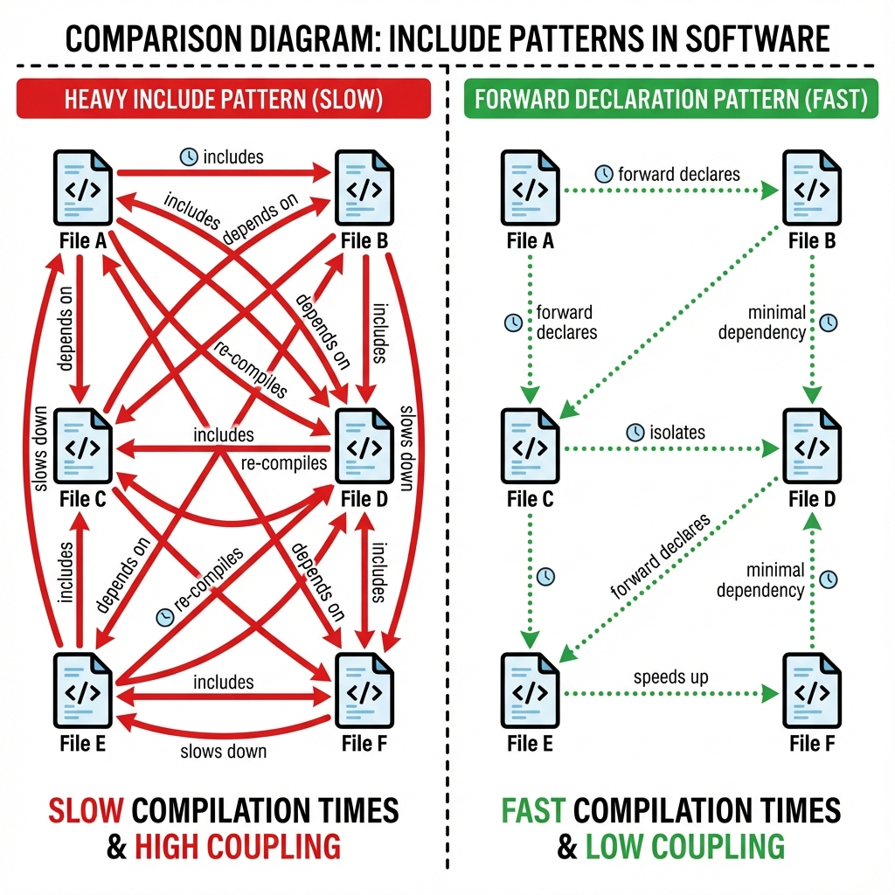
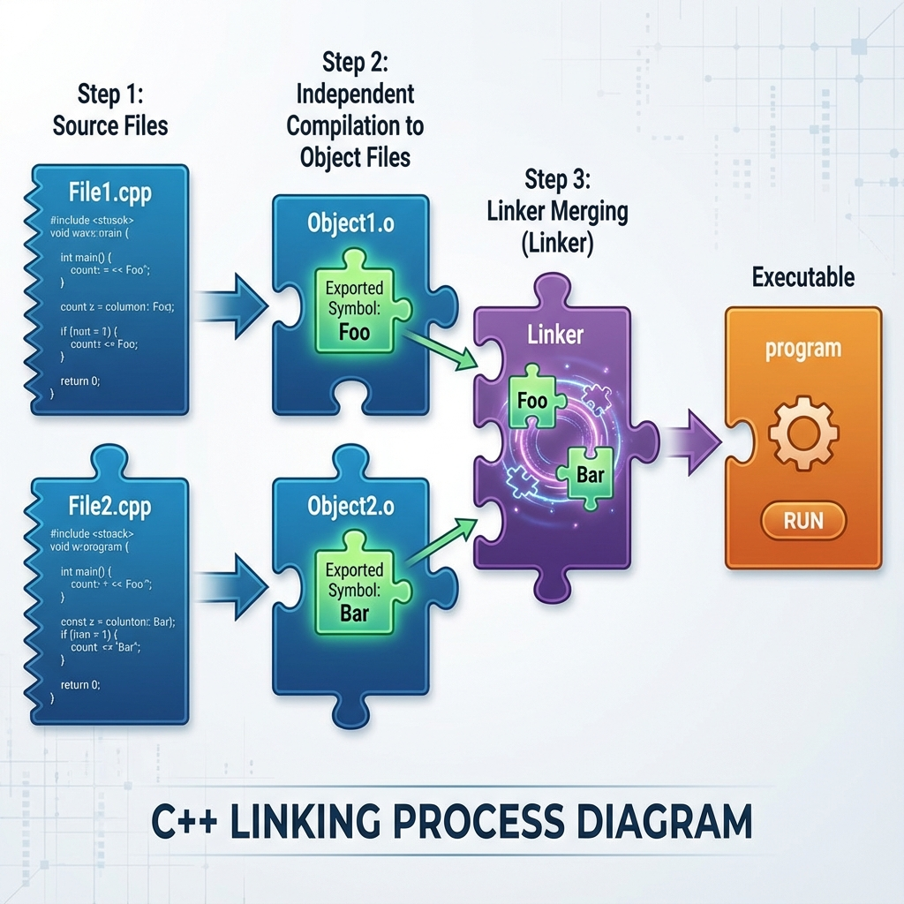

# 8. Structuring Codebase

## Namespaces & Scope
Namespaces prevent name collisions in large projects.
*   **Syntax**: `namespace System { class Core { ... }; }`.
*   **Anonymous Namespace**: `namespace { int x; }` makes `x` effectively **static** (internal linkage) to the current file. Better than `static` global variables.
*   **Nested Namespaces**: `namespace A::B { ... }` (C++17).

## Forward Declaration vs Inclusion (`#include`)
*   **Header File (`.h`/`.hpp`)**: Contains declarations. Included in multiple source files.
*   **Forward Declaration**: `class MyClass;`. Tells compiler "Class exists" without defining it.
    *   **Pros**: Speeds up build significantly (reduces dependency graph). prevents circular dependencies.
    *   **Cons**: Can only use pointers/references to the type (e.g., `MyClass* ptr`), cannot access members.

<!--
    IMAGE GENERATION PROMPT:
    A comparison diagram: "Heavy Include Pattern" vs "Forward Declaration Pattern".
    Heavy: A mesh of dependencies where File A includes B, B includes C... (Slow).
    Forward Decl: Decoupled files, dotted lines representing minimal dependency.
    Visual style: Network graph, red (heavy) vs green (light) edges.
-->


## Linkage (Internal vs External)
Determines visibility of symbols across Translation Units (TU).
*   **External Linkage** (Default for functions/globals): Symbol is visible to linker; can be called from other files.
*   **Internal Linkage** (`static` or Anonymous Namespace): Symbol is visible **ONLY** within current `.cpp` file.
    *   *Usage*: Helper functions that shouldn't be exposed APIs.

<!--
    IMAGE GENERATION PROMPT:
    Diagram of Linking Process.
    File1.cpp -> Object1.o (Exports: 'Foo', Imports: 'Bar')
    File2.cpp -> Object2.o (Exports: 'Bar', Imports: 'Foo')
    Linker -> Connects 'Foo' to 'Foo', 'Bar' to 'Bar' -> Executable.
    Visual style: Puzzle piece connection diagram.
-->


## One Definition Rule (ODR)
*   **Rule**: A template/function/class/variable can have:
    1.  **Exactly one definition** in the entire program (for non-inline functions/variables).
    2.  **Exactly one definition** per Translation Unit (for classes/inline functions), which must be identical.
*   **Inline Functions/Variables**: The `inline` keyword allows definitions in headers (multiple TUs) by telling linker "pick one, discard duplicates".

### Code Example: ODR Violation
```cpp
// Header.h
int x = 10; // ERROR: If included in 2 cpp files, 'x' is defined twice!

// Correct:
inline int x = 10; // C++17
// OR
extern int x; // Declaration
```

---

## Interview Questions

### Q1: What is the difference between `#include "file.h"` and `#include <file.h>`?
**Answer**:
*   `"file.h"`: Searches in the **current directory** of the source file first, then standard paths.
*   `<file.h>`: Searches only in the **system/compiler standard include paths**.

### Q2: Why use `static` in a global scope?
**Answer**:
*   To give the variable/function **Internal Linkage**.
*   It hides the symbol from the Linker, preventing "Multiple Definition" errors if another file uses the same name.
*   *Modern C++ preference*: Use **Anonymous Namespaces** instead of `static`.

### Q3: What prevents a header file from being included multiple times?
**Answer**:
*   **Include Guards**: `#ifndef MY_HEADER_H ... #endif` (Standard).
*   **Pragma Once**: `#pragma once` (Non-standard but supported by all major compilers). Faster (compiler doesn't open file to check).

### Q4: Explain the "Pimpl" (Pointer to Implementation) idiom.
**Answer**:
*   A technique to hide private implementation details from the header file.
*   **How**: The public class holds a `unique_ptr` to a forward-declared internal class.
*   **Benefit**: ABI stability, faster compile times (changing private members doesn't force recompilation of consumers).
