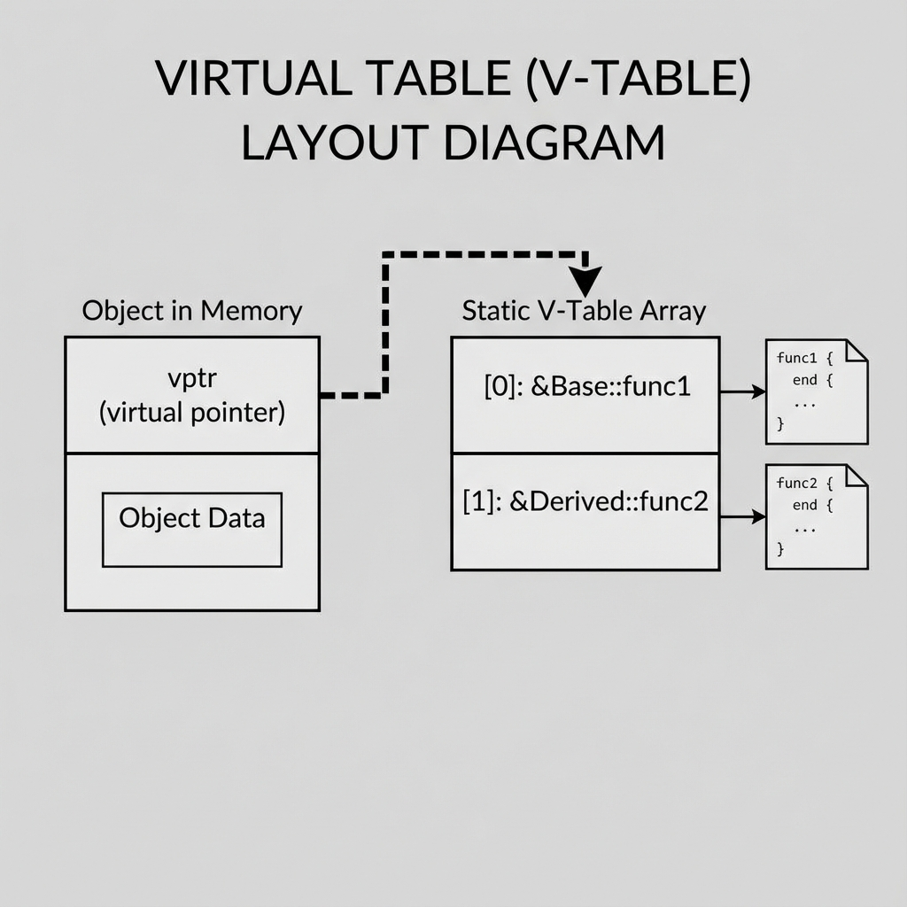

# 9. User-Defined Types

## Struct vs Class vs Union
| Feature | Class | Struct | Union |
| :--- | :--- | :--- | :--- |
| **Default Access** | `private` | `public` | `public` |
| **Default Inheritance** | `private` | `public` | N/A |
| **Memory Usage** | Sum of members + padding | Sum of members + padding | Max(largest member) |
| **Use Case** | OOP, Invariants, Encapsulation | Data bundles (POD), C-interop | Low-level type punning |

### Inheritance Modes
*   **Default Mode**:
    *   `class Derived : Base` -> Defaults to **Private** Inheritance.
    *   `struct Derived : Base` -> Defaults to **Public** Inheritance.
*   **Public Inheritance** (`: public Base`): `public` -> `public`, `protected` -> `protected`. (Is-A relationship).
*   **Protected Inheritance** (`: protected Base`): `public/protected` -> `protected`.
*   **Private Inheritance** (`: private Base`): `public/protected` -> `private`. (Has-A relationship, implemented-in-terms-of).

## Polymorphism & Virtual Tables
*   **Virtual Function**: Resolved at runtime via V-Table.
*   **Pure Virtual Function**: `virtual void foo() = 0;`. Makes the class **Abstract** (Instantiated objects not allowed).
*   **V-Table Mechanism**:
    1.  Compiler generates a static `vtable` array for the class containing function pointers.
    2.  Object stores a hidden `vptr` (usually at start of object) pointing to this table.
    3.  Call `obj->func()` becomes `obj->vptr[index]()`.
    *   **Overhead**: 1 pointer per object (RAM) + 1 table per class (Static) + Double Indirection (CPU).

<!--
    IMAGE GENERATION PROMPT:
    A diagram of Virtual Table Layout.
    Object in memory containing 'vptr' -> pointing to 'V-Table'.
    V-Table containing function pointers: [ &Base::func1, &Derived::func2 ].
    Visual style: Memory block diagram, showing the indirection.
-->


## Rule of Five (Resource Management)
Modern C++ (C++11+) Idiom for classes managing raw resources (pointers, handles).
1.  **Destructor**: Clean up resource.
2.  **Copy Constructor**: Deep copy resource (Don't just copy pointer!).
3.  **Copy Assignment**: Deep copy + clean up old resource.
4.  **Move Constructor**: Steal pointer from temporary source, set source to null (Cheap).
5.  **Move Assignment**: Cleanup own, Steal pointer, set source to null.

### Implementation Checklist
```cpp
class Buffer {
    int* data;
    size_t size;
public:
    // Constructor
    Buffer(size_t s) : size(s), data(new int[s]) {}
    
    // 1. Destructor
    ~Buffer() { delete[] data; }

    // 2. Copy Constructor (Deep Copy)
    Buffer(const Buffer& other) : size(other.size), data(new int[other.size]) {
        std::copy(other.data, other.data + size, data);
    }

    // 3. Copy Assignment (Deep Copy)
    Buffer& operator=(const Buffer& other) {
        if (this == &other) return *this; // Self-assignment check
        delete[] data;                    // Free old
        size = other.size;
        data = new int[size];             // Alloc new
        std::copy(other.data, other.data + size, data);
        return *this;
    }

    // 4. Move Constructor (Transfer Ownership)
    Buffer(Buffer&& other) noexcept : data(other.data), size(other.size) {
        other.data = nullptr; // Nullify source so destructor doesn't free it
        other.size = 0;
    }

    // 5. Move Assignment (Transfer Ownership)
    Buffer& operator=(Buffer&& other) noexcept {
        if (this == &other) return *this;
        delete[] data;       // Free own
        data = other.data;   // Steal
        size = other.size;
        other.data = nullptr; // Nullify source
        other.size = 0;
        return *this;
    }
};
```

---

## Interview Questions

### Q1: What is the "Diamond Problem" in Multiple Inheritance?
**Answer**:
*   When two classes (`B`, `C`) inherit from `A`, and `D` inherits from both `B` and `C`.
*   `D` ends up with **two copies** of `A`'s members.
*   **Fix**: Use **Virtual Inheritance** (`class B : virtual public A`). This ensures only one shared instance of `A`.

### Q2: Why is the Destructor virtual?
**Answer**:
*   To support proper deletion via a base class pointer.
*   `Base* b = new Derived(); delete b;`
*   If `~Base()` is not virtual, only `Base`'s destructor runs, leaking `Derived`'s resources. `virtual` ensures `~Derived()` runs first.

### Q3: How do Bitfields affect `sizeof`?
**Answer**:
*   The compiler packs bits into the underlying type.
*   Multiple bitfields are packed into adjacent storage units if they fit.
*   If a field crosses a unit boundary (e.g., byte boundary), behavior depends on alignment/padding rules. `sizeof` will be a multiple of byte/word alignment.

### Q4: Can a constructor be virtual?
**Answer**:
*   **No.** To create an object, you need to know the *exact* type at compile time.
*   Also, the V-Table pointer is initialized *inside* the constructor, so you can't use the V-Table before the object is built.
