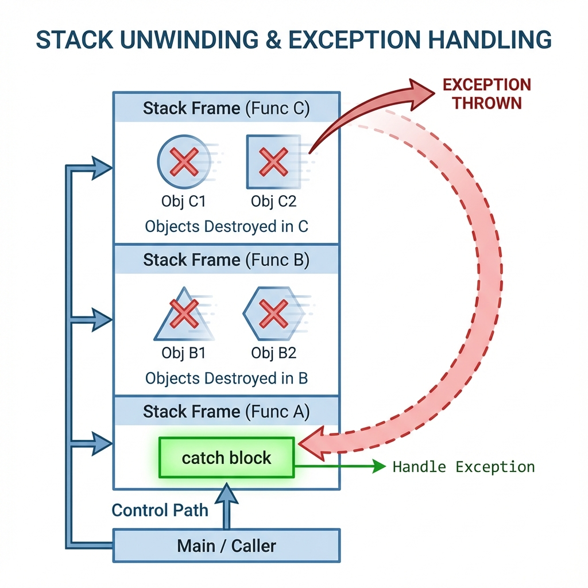

# 10. Exception Handling

## Exception Basics
Mechanism to handle runtime errors by transferring control up the stack.
*   `try`: Block of code that might throw.
*   `throw`: Signals an error occurred.
*   `catch`: Handles the specific error type.

## Stack Unwinding
When an exception is thrown, the runtime searches for the nearest matching `catch` block.
*   **Process**: It "unwinds" the stack, destroying all local objects in reverse order of creation.
*   **Destructors**: are guaranteed to be called for fully constructed objects.
*   **Terminate**: If no catch block is found, `std::terminate()` is called (Crash).

## Function Try Blocks
Allows catching exceptions thrown from the **Member Initializer List** in a constructor.
```cpp
Constructor() try : member(might_throw()) {
    // Body    
} catch (...) {
    // Handle exception from member init list
    // Implicitly rethrows!
}
```

## `noexcept` Specifier
Tells compiler/reader that a function **will not throw**.
*   `void func() noexcept;`
*   **Optimization**: Allows compiler to generate tighter code (no need to keep stack unwind tables for that frame).
*   **Move Operations**: **Always** mark Move Constructor/Assignment as `noexcept` if possible. `std::vector` will refuse to use move semantics during resize if they are not `noexcept` (Strong Exception Guarantee).

## Standard Exception Hierarchy
Inherit from `std::exception` (`<stdexcept>`).
*   `std::exception` (Base)
    *   `std::logic_error` (Bugs: `invalid_argument`, `out_of_range`)
    *   `std::runtime_error` (Unavoidable: `overflow_error`, `system_error`)
    *   `std::bad_alloc` (`new` fails)

<!--
    IMAGE GENERATION PROMPT:
    Diagram of Stack Unwinding.
    Stack frames (Func C -> Func B -> Func A). Exception thrown in C.
    Arrow showing control jumping back to catch block in A.
    Visualizing destruction of objects in B and C along the path.
-->


---

## Interview Questions

### Q1: Can a Destructor throw an exception?
**Answer**:
*   **NEVER**.
*   If a destructor throws *during* stack unwinding (caused by another exception), the runtime calls `std::terminate()` immediately because it can't handle two active exceptions at once.
*   Always wrap destructor code in `try-catch` and swallow errors if necessary.

### Q2: What happens if a Constructor throws?
**Answer**:
*   The Object is considered **not fully constructed**.
*   The **Destructor will NOT be called** for this object.
*   However, destructors for any *already constructed members* will be called.
*   **Risk**: If you `new` memory in the constructor before the throw and don't clean it up (or use smart pointers), it leaks.

### Q3: What is the "Strong Exception Guarantee"?
**Answer**:
*   **Commit or Rollback**.
*   If an operation (like `vector::push_back`) throws, the state of the program remains *unchanged* (as if the potential change never happened).
*   Achieved via **Copy-and-Swap** idiom.

### Q4: catch(exception) vs catch(exception&)?
**Answer**:
*   **Always catch by Reference** (`catch(const std::exception& e)`).
*   **Catch by Value** causes **Object Slicing** (Derived part is lost, virtual functions won't work correctly).
