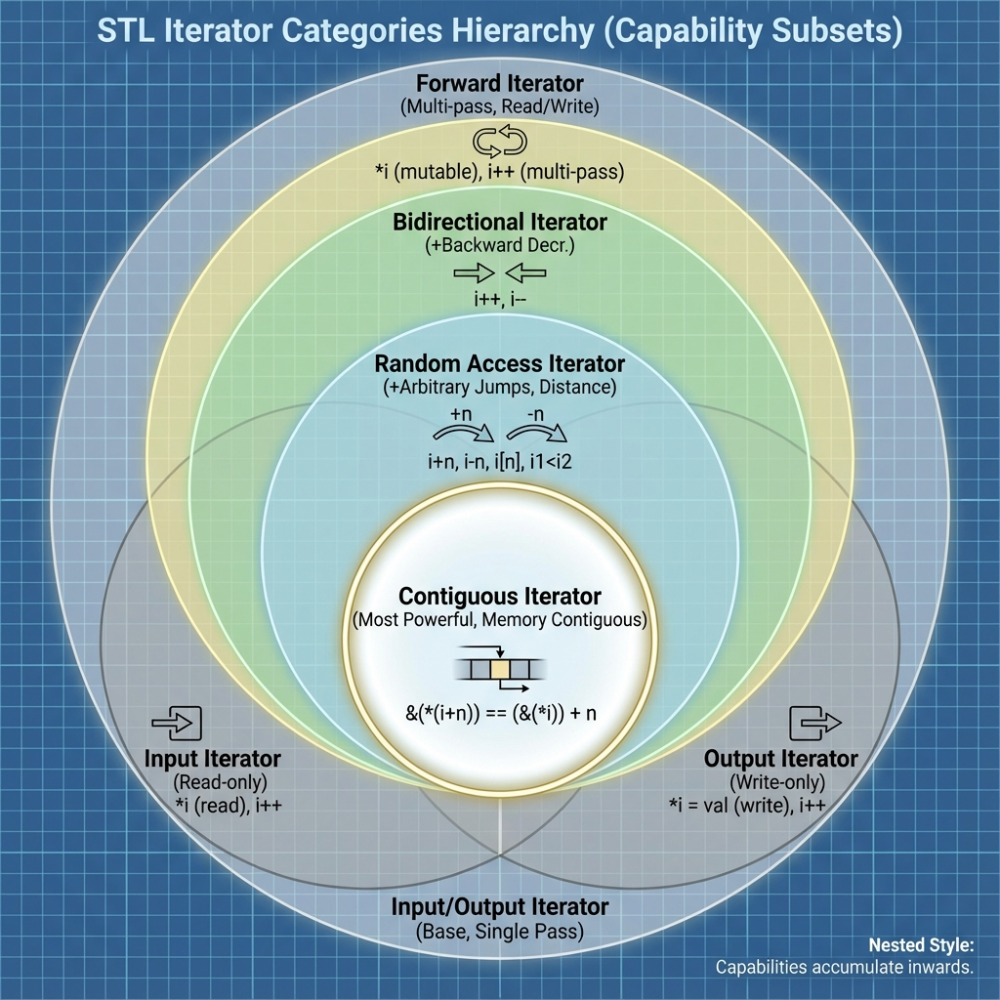

# 12. Standard Library + STL

## STL Components
1.  **Containers**: Store data (Vector, List, Map).
2.  **Iterators**: Traverse containers (Pointer-like abstraction).
3.  **Algorithms**: Process data (Sort, Find, Transform).
4.  **Functors**: Objects that act like functions (Lambda, Objects with `operator()`).

## Containers
| Type | Examples | Characteristics | Use Case |
| :--- | :--- | :--- | :--- |
| **Sequence** | `vector` | Contiguous memory, O(1) random access | Default choice (Cache friendly) |
| | `list` | Doubly linked list, O(1) insert/delete anywhere | Heavy mid-insertions |
| | `deque` | Double-ended queue, chunks of arrays | Queue/Stack implementation |
| **Associative** | `map`, `set` | Balanced BST (Red-Black Tree), O(log N), Sorted | Key-value lookups, Ordered data |
| **Unordered** | `unordered_map` | Hash Table, O(1) avg access, Unsorted | Fast independent lookups |
| **Adapters** | `stack`, `queue` | Restrict interface of sequence containers | LIFO / FIFO logic |

### Optimization: `push_back` vs `emplace_back`
*   **`push_back(Obj)`**: Constructs temporary object -> Moves/Copies it into vector -> Destroys temporary.
*   **`emplace_back(Args)`**: Constructs object **in-place** inside the vector using constructor arguments. Avoids temporary creation/move.
    *   `v.push_back(MyClass(1, 2));` // 1 Move
    *   `v.emplace_back(1, 2);`       // 0 Moves

## Iterator Categories
1.  **Input/Output**: Single pass (Console I/O).
2.  **Forward**: Multi-pass, one direction (`forward_list`).
3.  **Bidirectional**: Both directions (`list`, `map`, `set`).
4.  **Random Access**: Jump to any index (`vector`, `deque`, `array`).
5.  **Contiguous**: Physically adjacent memory (C++17) (`vector`, `string`).

### Iterator Invalidation
*   **Vector**: Adding elements (push_back) may reallocate memory, invalidating **ALL** iterators. Removing elements invalidates iterators *after* the removed point.
*   **List/Map**: Iterators remain valid after insertion/deletion (except the deleted one).

## Modern Utilities (C++17/20)
*   **`std::optional<T>`**: Wrapper that may or may not hold a value. Replaces NULL pointer checks or magic values.
*   **`std::variant<A, B>`**: Type-safe union. Holds either A or B.
*   **`std::any`**: Type-safe void*. Holds any copyable type.
*   **`std::string_view`**: Non-owning reference to a string string (pointer + length). Avoids copies.

<!--
    IMAGE GENERATION PROMPT:
    A schematic hierarchy of STL Iterator Categories.
    Input/Output (Base) -> Forward -> Bidirectional -> Random Access -> Contiguous (Most Powerful, at the center or top).
    Visual style: Venn diagram or Nested Circles showing capability subsets.
-->

## Multithreading Basics (`<thread>`, `<mutex>`)
*   **`std::thread`**: Represents a thread of execution. Must be `join()`ed or `detach()`ed before destruction.
*   **Race Condition**: Two threads access shared data concurrently, and at least one writes.
*   **Mutex (`std::mutex`)**: Mutual Exclusion. Locks critical sections.
*   **RAII Locks** (Always use these!):
    *   `std::lock_guard`: Locks on construction, unlocks on destruction. Simple.
    *   `std::unique_lock`: More flexible (can unlock/relock manualy).

---

## Interview Questions

### Q1: `map` vs `unordered_map`?
**Answer**:
*   **`map`**: BST. O(log N). Sorted keys. Uses `<` operator.
*   **`unordered_map`**: Hash Table. O(1) Avg, O(N) Worst. Unsorted. Uses `hash()` function.

### Q2: Why is `vector` usually better than `list` even for insertions?
**Answer**:
*   **Cache Locality**: Vector elements are contiguous. CPU prefetcher loves this. List nodes are scattered (cache misses).
*   **Overhead**: List stores 2 extra pointers per element.
*   **Vector**: only wins if insertions are at end. Mid-insertions are still O(N), but for small N, hardware speeed makes it faster than List's O(1) alloc + pointer chase.

### Q3: What is "Iterator Invalidation"?
**Answer**:
*   When a container changes shape (resize/realloc), existing iterators might point to freed memory or wrong elements.
*   Crucial for preventing SegFaults in loops (e.g., `erasing` inside a loop requires `it = erase(it)`).

### Q4: Difference between `std::lock_guard` and `std::unique_lock`?
**Answer**:
*   `lock_guard`: Lightweight, strictly scoped (RAII only).
*   `unique_lock`: Heavier, supports deferred locking, timeout locking (`try_lock_for`), and integration with Condition Variables.
