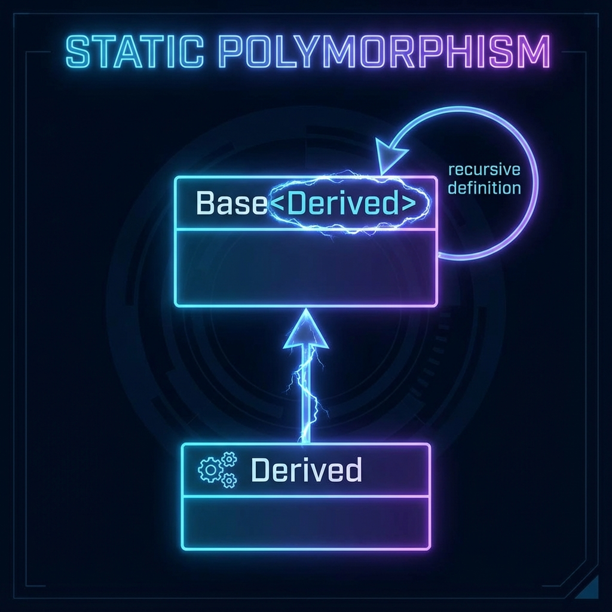

# 14. Idioms

## RAII (Resource Acquisition Is Initialization)
*   **Concept**: Bind the life cycle of a resource (memory, file, lock) to the life cycle of an object (scope).
*   **Destructor**: Is the single point of cleanup.
*   **Example**: `std::lock_guard`, `std::unique_ptr`, `std::fstream`.

## Copy-and-Swap
A robust way to implement the Assignment Operator (`operator=`) offering **Strong Exception Guarantee**.
```cpp
class Widget {
    int* data;
    size_t size;
public:
    // 1. Copy Ctor
    Widget(const Widget& other) : size(other.size), data(new int[other.size]) { ... }
    
    // 2. Swap helper (nothrow)
    friend void swap(Widget& first, Widget& second) noexcept {
        using std::swap;
        swap(first.data, second.data);
        swap(first.data, second.data);
    }
    
    // 3. Assignment Operator (Unified for Copy and Move)
    Widget& operator=(Widget other) { // Takes by value (Copy or Move)
        swap(*this, other);           // Swap with temp
        return *this;
    } // 'other' (holding old data) destroyed here
};
```

## CRTP (Curiously Recurring Template Pattern)
Static Polymorphism. A class `Derived` inherits from a template `Base` instantiated with `Derived`.
*   **Syntax**: `class Derived : public Base<Derived> { ... };`
*   **Usage**: `Base` can cast `this` to `Derived*` at compile time to call derived methods.
*   **Benefit**: No Virtual Table overhead (faster than dynamic polymorphism).
```cpp
template<typename Derived>
class Base {
public:
    void interface() {
        // Compile-time downcast
        static_cast<Derived*>(this)->implementation(); 
    }
};

class MyClass : public Base<MyClass> {
public:
    void implementation() { cout << "Static Polymorphism!"; } 
};
```

## Pimpl (Pointer to Implementation)
*   **Goal**: Hide implementation details to ensure ABI stability and reduce compile times.
*   **Structure**: Public class holds `std::unique_ptr<Impl>`. `Impl` class defined in `.cpp`.

<!--
    IMAGE GENERATION PROMPT:
    Diagram of CRTP Inheritance Loop.
    Class 'Derived' inherits from 'Base<Derived>'.
    Arrow pointing from Derived up to Base, and Base parameterized by Derived.
    Loop-like structure. Label: "Static Polymorphism".
    Visual style: UML class diagram with template syntax.
-->


---

## Interview Questions

### Q1: Benefit of Copy-and-Swap?
**Answer**:
*   **Reuse**: Reuses Copy Constructor (for copying) and Destructor (for cleanup).
*   **Exception Safety**: If copy construction fails (throws), we never enter the function, so `*this` is unchanged.
*   **No Self-Assignment Check**: Handling by-value parameter (`other`) makes explicit check unnecessary.

### Q2: CRTP vs Virtual Functions?
**Answer**:
*   **CRTP (Static)**: Resolved at compile time. No runtime cost. Cannot use `Base*` to store different Derived types in a container (no common base type unless you add another layer).
*   **Virtual (Dynamic)**: Resolved at runtime. Slower (V-Table). Flexible (can store `Base*` in vector).

### Q3: Why does `operator= ` take by value in Copy-and-Swap?
**Answer**:
*   To let the compiler handle the copy.
*   If we pass `const Widget&`, we have to make a copy inside. Passing by value does it implicitly (potentially elided or moved).

### Q4: What is SSO (Small String Optimization)?
**Answer**:
*   An idiom used by `std::string`.
*   Small strings (e.g., < 16 chars) are stored directly inside the string object (stack/inline buffer) to avoid Heap allocation.
*   Only large strings allocate memory on Heap.
