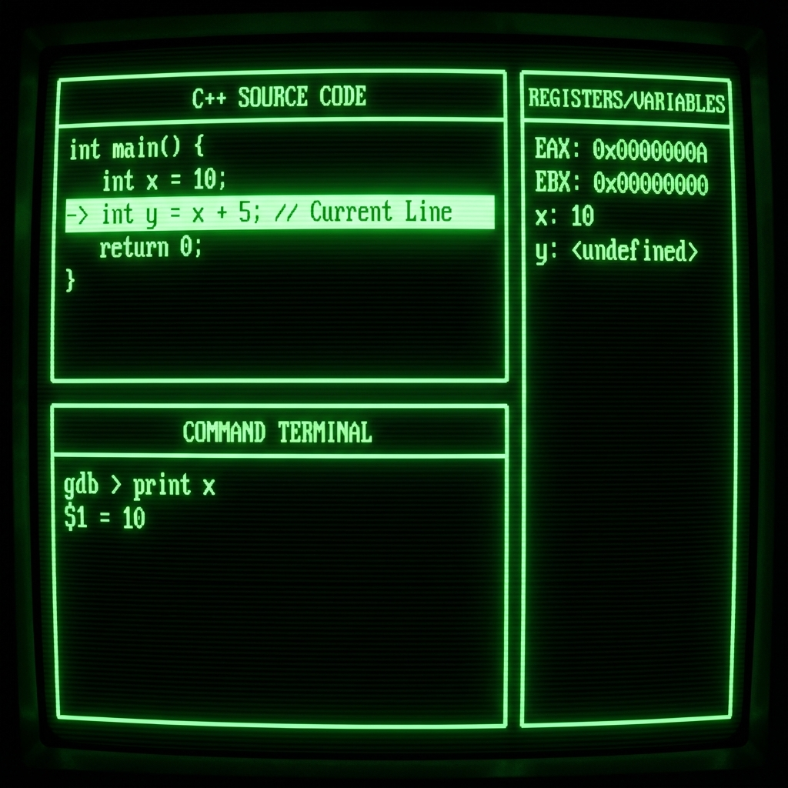

# 16. Debuggers (GDB / LLDB)

## Basics
Debuggers allow inspecting a program's state while it runs to find bugs.
*   **GDB**: GNU Debugger (Standard on Linux/GCC).
*   **LLDB**: LLVM Debugger (Standard on macOS/Clang).
*   **Compilation**: Must compile with `-g` flag to include debug symbols. (`g++ -g main.cpp`).

## Essential Commands
| Action | GDB Command | LLDB Command |
| :--- | :--- | :--- |
| **Start** | `run` / `r` | `run` / `r` |
| **Breakpoint** | `break main` / `b 10` | `breakpoint set -n main` / `b main` |
| **Next Line (Over)** | `next` / `n` | `next` / `n` |
| **Step Into (Function)** | `step` / `s` | `step` / `s` |
| **Continue** | `continue` / `c` | `continue` / `c` |
| **Print Variable** | `print x` / `p x` | `frame variable x` / `p x` |
| **Backtrace** | `backtrace` / `bt` | `thread backtrace` / `bt` |

## Advanced Debugging
1.  **Watchpoints**: Pause when a variable's value *changes* (Hardware supported).
    *   `watch x`
2.  **Conditional Breakpoints**: Pause only if condition is true.
    *   `break 20 if x > 5`
3.  **TUI Mode (Text User Interface)**: Shows source code split screen.
    *   `Ctrl + X, A` (in GDB).

## Core Dumps
Snapshot of memory when a program crashes (SegFault).
1.  Enable: `ulimit -c unlimited`
2.  Run program -> Crashes -> Generates `core` file.
3.  Analyze: `gdb ./my_program core` -> `bt` shows exactly where it crashed.

<!--
    IMAGE GENERATION PROMPT:
    Diagram of a Debugger TUI (Text User Interface).
    Split screen:
    Top: C++ Source Code with a highlighted "Current Line".
    Bottom: Command Terminal ("gdb > print x").
    Side: Register/Variable values.
    Visual style: Retro Terminal/Hacker-style green text on black.
-->

---

## Interview Questions

### Q1: Difference between Valid and Invalid Memory Access?
**Answer**:
*   **Valid**: Accessing memory allocated to your process (Stack frames, Heap blocks you own).
*   **Invalid**: Accessing 0x0 (Null), freed memory (Dangling), or kernel space. Causes `SIGSEGV` (Segmentation Fault).

### Q2: What are Debug Symbols?
**Answer**:
*   Generated by `-g`.
*   A mapping between **Machine Code** addresses (0x4005d) and **Source Code** lines (main.cpp:15).
*   Without them, the debugger only shows assembly and hex addresses, not variable names.

### Q3: Why does `p x` sometimes say "optimized out"?
**Answer**:
*   If you compile with optimization (`-O2` or `-O3`), the compiler might store `x` only in a register (never in RAM) or remove it entirely if it's constant.
*   **Fix**: Debug with `-O0` (No optimization) to see all variables.

### Q4: How to debug a "Heisenbug"? (Bug disappears when debugging)
**Answer**:
*   Often caused by **Race Conditions** (debugger changes timing) or **Uninitialized Memory** (debugger initializes it to 0).
*   **Strategy**: Use logging (`std::print`), Sanitizers (`AddressSanitizer`, `ThreadSanitizer`), or analyzing Core Dumps instead of live stepping.
