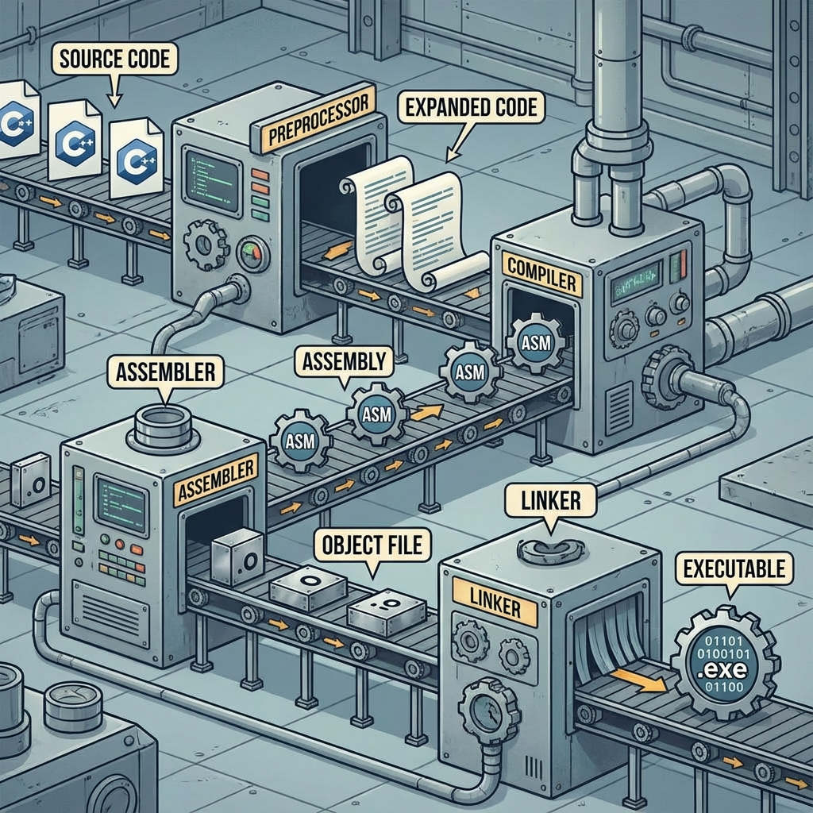

# 17. Compilers

## The Build Pipeline
1.  **Preprocessing** (`.cpp` -> `.i`): Handles `#include`, `#define`, `#ifdef`. Text substitution.
2.  **Compilation** (`.i` -> `.s`): Translates C++ code to Assembly instructions.
3.  **Assembly** (`.s` -> `.o`): Translates Assembly to Machine Code (Object file).
4.  **Linking** (`.o` + Libraries -> `.exe`): Combines object files, resolves symbols (`extern`), links libraries (`.a`/`.so`/`.lib`/`.dll`).

## Common Compilers
*   **GCC (GNU Compiler Collection)**: Standard on Linux (`g++`).
*   **Clang (LLVM)**: Standard on macOS/Android. Faster compile times, better error messages.
*   **MSVC (Microsoft Visual C++)**: Standard on Windows.

## Essential Flags (GCC/Clang)
| Flag | Purpose | Description |
| :--- | :--- | :--- |
| `-Wall -Wextra` | **Warnings** | Enable all common warnings. **Always use these.** |
| `-Werror` | **Strictness** | Treat warnings as errors (Stops build). |
| `-std=c++20` | **Standard** | Use C++20 standard features. |
| `-O0` | **Debug** | No optimization. Best for debugging. |
| `-O2` / `-O3` | **Release** | High optimization. Faster code, slower build, harder to debug. |
| `-g` | **Debug Info** | Include symbols for GDB/LLDB. |
| `-I<path>` | **Include** | Add directory to header search path. |
| `-L<path>` | **Lib Path** | Add directory to library search path. |
| `-L<path>` | **Lib Path** | Add directory to library search path. |
| `-l<name>` | **Link Lib** | Link against library (e.g., `-lm` for math). |
| `-flto` | **LTO** | Link Time Optimization. Optimizes across object files during linking (Slow build, Fast code). |

<!--
    IMAGE GENERATION PROMPT:
    Diagram of the C++ Build Pipeline.
    Steps: Preprocessor -> Compiler -> Assembler -> Linker.
    Input/Output icons: Source Code -> Expanded Code -> Assembly -> Object File -> Executable.
    Visual style: Factory conveyor belt or Flowchart.
-->

---

## Interview Questions

### Q1: What is "Undefined Reference" error?
**Answer**:
*   A **Linker Error**.
*   The compiler found the *declaration* of a function (in header), so it compiled the code successfully.
*   But the Linker could not find the *definition* (implementation) in any of the object files or libraries.
*   **Causes**: Missing `.cpp` file in build command, missing library, or name mangling mismatch (extern "C").

### Q2: Difference between Static Linking and Dynamic Linking?
**Answer**:
*   **Static (`.a`/`.lib`)**: Library code is copied *into* your executable.
    *   *Pros*: Portable (no dependency hell), fast startup.
    *   *Cons*: Large file size, harder to update library (must recompile app).
*   **Dynamic (`.so`/`.dll`)**: Library code stays in a separate file. Loaded at runtime.
    *   *Pros*: Small exe, easy to update lib.
    *   *Cons*: "DLL Missing" errors, version conflicts.

### Q3: What does the `-fPIC` flag do?
**Answer**:
*   **Position Independent Code**.
*   Required for building **Shared Libraries** (`.so`).
*   Ensures the code works no matter where it is loaded in memory (uses relative addressing).

### Q4: Why use Forward Declarations instead of Includes?
**Answer**:
*   To reduce **Compile Time** and break **Circular Dependencies**.
*   If `A.h` changes, and `B.cpp` only forward declares `A`, `B` doesn't need recompilation (unless the *interface* changes).
