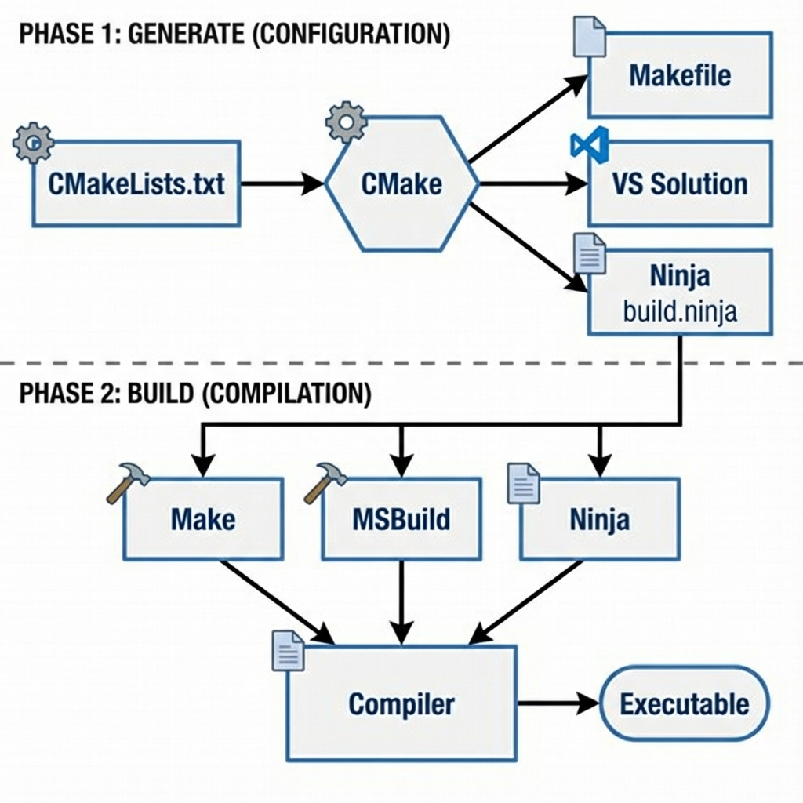

# 18. Build Systems

## Why Build Systems?
Compiling single files (`g++ main.cpp`) is easy. Compiling 100 files with dependencies, libraries, and strict flags is hard. Build systems automate this.

## Make (Legacy)
*   **Format**: `Makefile`.
*   **Concept**: Rule-based. "Target T depends on source S. If S is newer than T, run command to build T".
*   **Pros**: Installed everywhere.
*   **Cons**: Scripts are platform-dependent (Windows commands != Linux commands). Hard to maintain.

## CMake (De Facto Standard)
*   **Concept**: A "Build System Generator". It doesn't build code; it generates `Makefiles` (Linux) or `.sln` (Visual Studio) or `ninja.build` based on `CMakeLists.txt`.
*   **Pros**: Cross-platform. Huge ecosystem support.

### Basic `CMakeLists.txt`
```cmake
cmake_minimum_required(VERSION 3.10)
project(MyProject)

set(CMAKE_CXX_STANDARD 20)

# Add Executable
add_executable(MyApp main.cpp utils.cpp)

# Add Include Directories
target_include_directories(MyApp PUBLIC include)

# Link Libraries
find_package(Threads REQUIRED)
target_link_libraries(MyApp PRIVATE Threads::Threads)
```

### Pro Tip: Tooling Support
*   `set(CMAKE_EXPORT_COMPILE_COMMANDS ON)`
*   Generates `compile_commands.json`. Tools like **Clangd** (VSCode extension) use this to understand your project structure, providing accurate Autocomplete/Go-to-Definition.

## Ninja
*   A small, extremely fast build system designed to have its input files generated by CMake/Meson.
*   **Speed**: Parallelizes builds massively.
*   **Usage**: `cmake -G Ninja ..` -> `ninja`.

<!--
    IMAGE GENERATION PROMPT:
    Diagram of CMake Build Workflow.
    Phase 1: Configuration (CMakeLists.txt -> CMake -> [Makefile / VS Solution / Ninja]).
    Phase 2: Build ([Make / MSBuild / Ninja] -> Compiler -> Executable).
    Visual style: Flowchart split into "Generate" and "Build" phases.
-->


---

## Interview Questions

### Q1: Difference between `PUBLIC`, `PRIVATE`, and `INTERFACE` in CMake?
**Answer**:
*   **PRIVATE**: I use this library, but people linking to me don't need it.
*   **INTERFACE**: I don't need this library to compile, but people linking to me do. (Header-only libs).
*   **PUBLIC**: I use it, and people linking to me also need it.

### Q2: Why use CMake over Makefiles?
**Answer**:
*   **Cross-Platform**: CMake generates VS solutions for Windows devs and Makefiles for Linux devs from the *same* source file.
*   **Depedency Management**: `find_package` locates system libraries automatically (e.g., OpenCV, Boost) better than hardcoded paths in Makefiles.

### Q3: What is "Out-of-Source Build"?
**Answer**:
*   Running CMake in a separate `build/` directory.
*   Keeps source tree clean (no generated `.o` or `.exe` files mixed with `.cpp`).
*   To clean up: just delete `build/` folder.

### Q4: What is `vcpkg` or `Conan`?
**Answer**:
*   C++ Package Managers.
*   They solve the "Dependency Hell" by downloading, compiling, and installing libraries (like Boost, fmt) so CMake can find them easily.
