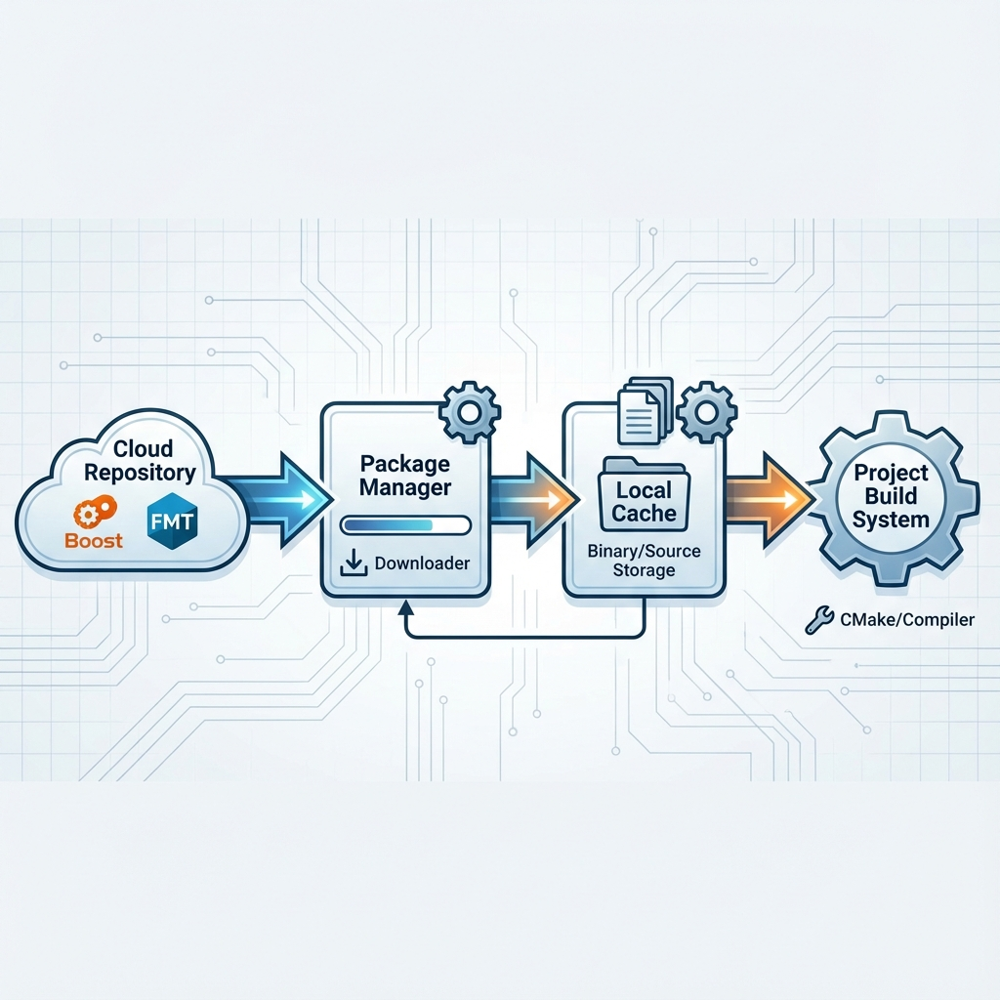

# 19. Package Managers

## The Problem: Dependency Hell
*   In C++, there is no standard repository like NPM (JS) or PIP (Python).
*   Historically, you had to manually download source code, compile it, and set include/lib paths.
*   **Version Conflicts**: Library A needs Boost 1.70, Library B needs Boost 1.80. Nightmare.

## vcpkg (Microsoft)
*   **Philosophy**: "Build from Source". Downloads upstream source and builds it on your machine.
*   **Ease of Use**: Very easy.
*   **Commands**:
    *   `./vcpkg install fmt`
    *   `./vcpkg integrate install` (Makes libs available globally in VS).
*   **CMake Integration**:
    *   `cmake -DCMAKE_TOOLCHAIN_FILE=[path/to/vcpkg.cmake] ..`
*   **Manifest Mode** (`vcpkg.json`): Modern way. Just define dependencies in a json file in your project root, and vcpkg installs them automatically during CMake config.

## Conan (JFrog)
*   **Philosophy**: "Binary Packages". Downloads pre-compiled binaries (if available) matching your OS/Compiler.
*   **Configuration**: `conanfile.txt` lists dependencies.
*   **Power**: Complex configuration management (Debug vs Release, Static vs Shared).

<!--
    IMAGE GENERATION PROMPT:
    Diagram of C++ Package Manager Workflow (vcpkg/Conan).
    Cloud Repository (Boost, FMT) -> Package Manager (Download) -> Local Cache -> Project Build System (CMake).
    Visual style: Cloud syncing to local gear architecture.
-->

---

## Interview Questions

### Q1: Benefit of using a Package Manager vs Git Submodules?
**Answer**:
*   **Transitive Dependencies**: Package managers handle "Lib A depends on Lib B" automatically. Submodules require you to manually add B.
*   **Build Times**: Package managers cache builds. Submodules rebuild every time you clean your project.

### Q2: What is a "Toolchain File" in CMake?
**Answer**:
*   A script passed to CMake (`-DCMAKE_TOOLCHAIN_FILE=...`) that tells it **how** to compile.
*   Used for **Cross-Compilation** (Targeting Android/iOS) and **Package Managers** (telling CMake where `vcpkg` libraries are located).

### Q3: Why prefer Static Linking for deployed apps?
**Answer**:
*   **Simplicity**: You ship one `.exe`. The user doesn't need to install DLLs or run installers.
*   **Reliability**: No crashes due to mismatched DLL versions on the user's machine.

### Q4: Drawbacks of Static Linking?
**Answer**:
*   **File Size**: Executable grows large.
*   **Security Updates**: If OpenSSL has a bug, you must recompile and redistribute your entire app. Dynamic linking allows replacing just the `openssl.dll`.
