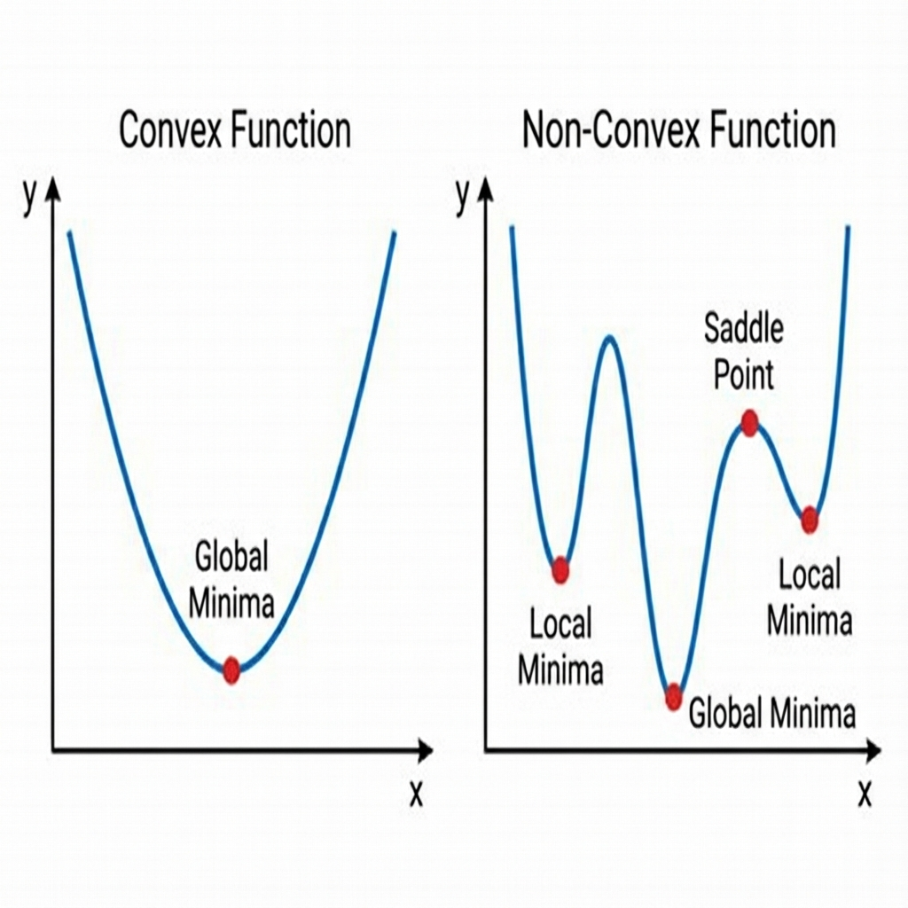

# Gradient Descent

> **Definition**: A first-order iterative optimization algorithm used to find the **local minimum** of a differentiable function.
> *   *Concept*: Take repeated steps in the opposite direction of the gradient (slope) to reach the bottom of the valley (Loss Function).

### Intuition
Imagine you are at the top of a mountain (high error/loss) blindfolded. You want to reach the bottom (minimum error).
*   **Strategy**: Feel the slope of the ground under your feet.
*   **Step**: Take a step downhill (opposite to steepest slope).
*   **Repeat**: Keep doing this until the slope is flat (0), which means you reached a valley.

**Loss Function $J(m, b)$**:
Since standard Linear Regression uses **Mean Squared Error (MSE)**, the loss function is a **Convex Function** (Bowl / Parabola).
*   It has only **one** Global Minima.

<!-- 
IMAGE_PROMPT: 
Type: 3D Surface Plot
Description: A distinct 'U' shaped bowl (Convex function). A ball rolling down from the top edge towards the center bottom. Arrows defining the path 'Descent'.
Style: Neon, dark background.
-->


---

### The Algorithm (Maths)

We want to find $m$ (slope) and $b$ (intercept) that minimize $J$.

1.  **Initialize**: Start with random values for $m$ and $b$ (e.g., $m=0, b=0$).
2.  **Hyperparameters**:
    *   **Epochs**: Number of iterations (e.g., 1000).
    *   **Learning Rate ($\alpha$ or $\eta$)**: Size of the step we take (e.g., 0.01).
3.  **Loop** (for each epoch):
    *   Calculate **Slope** (Gradient) at current $m, b$.
        $$ \text{Slope}_m = \frac{\partial J}{\partial m} = -2 \sum_{i=1}^n x_i(y_i - (mx_i+b)) $$
        $$ \text{Slope}_b = \frac{\partial J}{\partial b} = -2 \sum_{i=1}^n (y_i - (mx_i+b)) $$
    *   **Update Weights**: Move against the slope.
        $$ m_{\text{new}} = m_{\text{old}} - \alpha \times \text{Slope}_m $$
        $$ b_{\text{new}} = b_{\text{old}} - \alpha \times \text{Slope}_b $$
4.  **Stop**: When max epochs reached OR change in loss is negligible (convergence).

---

### Effect of Learning Rate ($\alpha$)
*   **Too Small**: Takes tiny steps. Convergence is very **slow**.
*   **Too Large**: Takes giant jumps. Might **overshoot** the minima and bounce around (diverge).
*   **Just Right**: Converges smoothly and efficiently.

---

### Convex vs Non-Convex Functions
*   **Convex Function**: Like a bowl. Has only **One Global Minima**. (e.g., Linear Regression / MSE).
    *   *Gradient Descent is guaranteed to find the global minimum.*
*   **Non-Convex Function**: Like a rocky terrain with many valleys. Has multiple **Local Minima** and **Saddle Points**. (e.g., Deep Gradients).
    *   *Gradient Descent might get stuck in a local minimum.*

<!-- 
IMAGE_PROMPT: 
Type: 2D Comparison Plot
Description: 
- Left: A smooth U-curve (Convex) labeled "Global Minima".
- Right: A squiggly curve with multiple dips (Non-Convex).
- Highlight "Local Minima" (small dip), "Global Minima" (deepest dip), and "Saddle Point" (flat but not min/max).
Style: Educational cartoon style.
-->



---

### Types of Gradient Descent

How many data points do we use to calculate the gradient (slope) in one step?

#### 1. Batch Gradient Descent
*   **Method**: Uses **ALL** $n$ data points in the training set to calculate the gradient for a single update.
*   **Pros**: Stable convergence, accurate slope.
*   **Cons**: Very slow for large datasets. High computation.
*   *Analogy*: Asking every single voter before making a policy change.

#### 2. Stochastic Gradient Descent (SGD)
*   **Method**: Uses **ONE** random data point to calculate the gradient and update weights.
*   **Pros**: extremely fast iterations. Good for massive data.
*   **Cons**: Noisy convergence (zigzag path). Might never settle exactly at minima.
*   *Analogy*: Asking one random person on the street and changing policy immediately.

#### 3. Mini-Batch Gradient Descent
*   **Method**: Uses a small **batch** of data points (e.g., 32, 64) for one update.
*   **Pros**: Best of both worlds. Faster than Batch, more stable than SGD.
*   **Cons**: Needs tuning of batch size.
*   *Analogy*: Asking a small focus group before making a change.

---

### Python Implementation (From Scratch)

```python
import numpy as np

class MeraGDRegressor:
    def __init__(self, learning_rate=0.01, epochs=100):
        self.m = 100 # Random init
        self.b = -120 # Random init
        self.lr = learning_rate
        self.epochs = epochs
        
    def fit(self, X, y):
        # Calc Gradient Descent
        for i in range(self.epochs):
            slope_b = -2 * np.sum(y - (self.m * X + self.b))
            slope_m = -2 * np.sum((y - (self.m * X + self.b)) * X)
            
            # Update
            self.b = self.b - (self.lr * slope_b)
            self.m = self.m - (self.lr * slope_m)
            
        print(f"Final m: {self.m}, Final b: {self.b}")
        
    def predict(self, X):
        return self.m * X + self.b
```

---

### Interview Questions

**Q1: What is the Learning Rate and why is it important?**
*   **Ans**: It is a hyperparameter that controls the **step size** at each iteration while moving toward a minimum of a loss function.
    *   Small $\alpha$: Reliable but slow.
    *   Large $\alpha$: Fast but risky (unstable/diverges).

**Q2: Difference between Local and Global Minima?**
*   **Ans**:
    *   **Global Minima**: The absolute lowest point of the entire function.
    *   **Local Minima**: A point lower than its immediate neighbors but not the lowest overall.
    *   *Note*: In Linear Regression (convex), Local Minima = Global Minima.

**Q3: What is a Saddle Point?**
*   **Ans**: A point where the gradient is zero (flat), but it is not a minima or maxima (slope goes up in one direction and down in another). It traps Gradient Descent in non-convex problems (like Neural Networks).

**Q4: Does Gradient Descent always find the optimal solution?**
*   **Ans**:
    *   For **Convex** functions (Linear Regression): **Yes**, usually converges to global minima.
    *   For **Non-Convex** functions: **No**, it can get stuck in local minima or saddle points.

**Q5: What are the types of Gradient Descent?**
*   **Ans**:
    1.  **Batch GD**: Uses **all** data points for one update (Slow, stable).
    2.  **Stochastic GD (SGD)**: Uses **one** random point for one update (Fast, noisy/jittery).
    3.  **Mini-Batch GD**: Uses a **small batch** (e.g., 32) (Best of both worlds).
