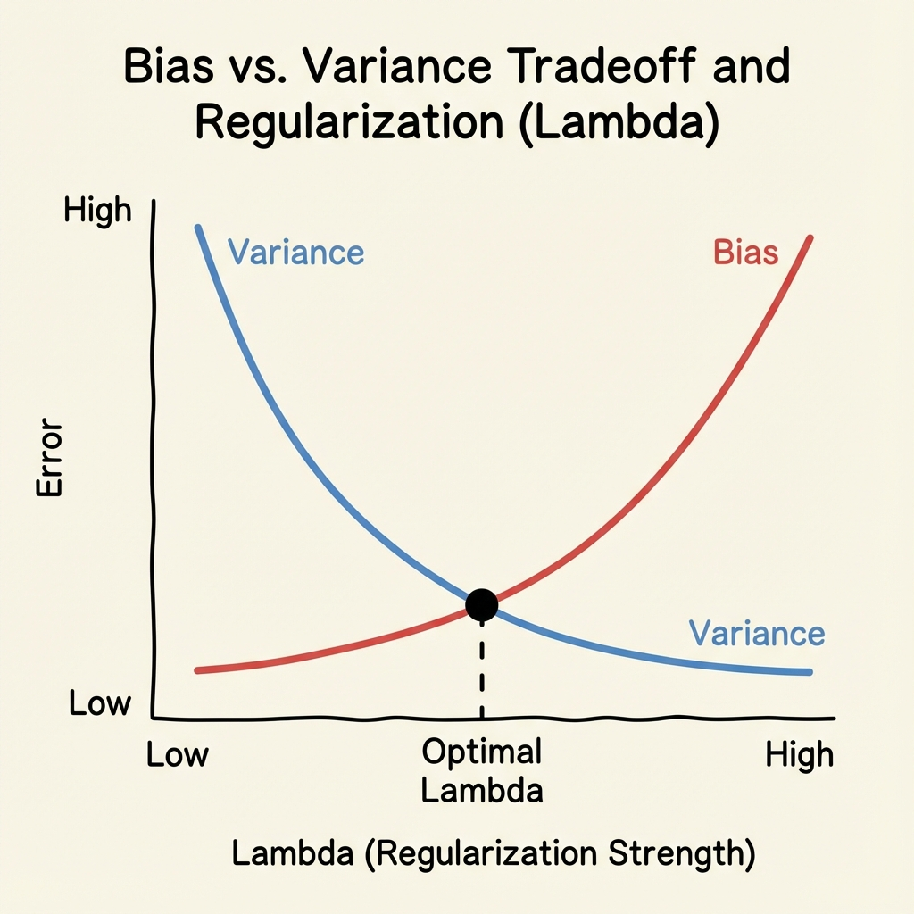

# Ridge Regression (L2 Regularization)

> **Definition**: A modification of Linear Regression that adds a penalty term equivalent to the **square of the magnitude** of coefficients. This technique is used to prevent **Overfitting** by shrinking the coefficients.

### Mathematical Formulation

#### 1. The Loss Function
We modify the standard MSE Loss function by adding a penalty term:

$$ \text{Loss} = \sum_{i=1}^{n} (y_i - \hat{y}_i)^2 + \lambda \sum_{j=1}^{p} \beta_j^2 $$
$$ J(\beta) = \text{MSE} + \lambda ||\beta||^2 $$

*   **$\lambda$ (Lambda)**: Hyperparameter (Penalty term). Also called **Shrinkage Coefficient**.
    *   $\lambda = 0$: Same as OLS (No Regularization).
    *   $\lambda \to \infty$: Coefficients $\to 0$ (Underfitting).
*   **$\beta^2$**: L2 Norm. Notice we sum squared coefficients.

#### 2. Modified OLS Formula (For Simple LR)
$$ m = \frac{\sum (y_i - \bar{y})(x_i - \bar{x})}{\sum (x_i - \bar{x})^2 + \lambda} $$
*   Notice the $+\lambda$ in the denominator. As $\lambda$ increases, the denominator increases, causing slope $m$ to decrease (shrink).

#### 3. Gradient Descent Formulation
$$ L = (Xw - Y)^T(Xw - Y) + \lambda ||w||^2 $$

---

### Key Properties (User Notes)

1.  **Shrinkage Behavior**:
    *   As $\lambda \uparrow$, coefficients ($w_i$) $\downarrow$.
    *   **Crucial Note**: The coefficients shrink towards zero but **never become exactly zero**.
    *   This implies Ridge Regression includes **all features** in the final model (no feature selection).

2.  **Impact on Large Coefficients**:
    *   Higher valued coefficients are impacted **more** significantly.
    *   If $w_1 < w_2 < w_3$, and we increase $\lambda$, shrinkage $\Delta w_3 > \Delta w_2 > \Delta w_1$. The model penalizes large weights more aggressively to reduce variance.

3.  **Bias - Variance Tradeoff w.r.t $\lambda$**
    *   **Low $\lambda$**: Model relies heavily on weights $\rightarrow$ Overfitting (High Variance, Low Bias).
    *   **High $\lambda$**: Weights are shrunk too much $\rightarrow$ Underfitting (Low Variance, High Bias).
    *   **Goal**: Find optimal $\lambda$ (intersection point) where Total Error is minimum.

<!-- 
IMAGE_PROMPT: 
Type: Line Chart
Description: 
- X-axis: Lambda ($\lambda$) value increasing.
- Y-axis: Error / Magnitude.
- Curve 1 (Variance): Starts high, goes down as lambda increases.
- Curve 2 (Bias): Starts low, goes up as lambda increases.
- Intersection: Optimal Lambda.
Style: Educational graph from notes.
-->



4.  **When to apply?**: Usually when Number of inputs (features) $\ge 2$. Also effective when features are correlated (Multicollinearity).

---

### Python Implementation (Scikit-Learn)

```python
from sklearn.linear_model import Ridge
from sklearn.model_selection import GridSearchCV

# Standard Scaling is MUST for Regularization
# because penalty depends on magnitude of coefficients!

# Ridge Model
# alpha is the parameter name for lambda in sklearn
ridge = Ridge(alpha=1.0) 
ridge.fit(X_train_scaled, y_train)

print(f"Coefficients: {ridge.coef_}")

# Finding optimal Lambda (alpha) using Cross Validation
params = {'alpha': [0.001, 0.01, 0.1, 1, 10, 100]}
model = GridSearchCV(Ridge(), params, cv=5)
model.fit(X_train_scaled, y_train)

print(f"Best Alpha: {model.best_params_}")
```

---

### Interview Questions

**Q1: Why does Ridge Shrink coefficients but never set them to zero?**
*   **Ans**: The penalty term $\lambda \beta^2$ is a quadratic function (convex parabola). When determining derivatives during optimization, the gradient approaches zero asymptotically but technically never hits absolute zero unless $\lambda$ is infinity. Unlike L1 (Lasso) which has a "V" shape (sharp corner at 0), L2 is smooth.

**Q2: How does $\lambda$ affect Bias and Variance?**
*   **Ans**: Increasing $\lambda$ increases Bias (simplifies model) and decreases Variance (reduces sensitivity to noise).

**Q3: When would you choose Ridge over OLS?**
*   **Ans**: 
    1.  When the model is Overfitting.
    2.  When there is Multicollinearity (features are highly correlated). Ridge stabilizes the matrix inversion in these cases.
