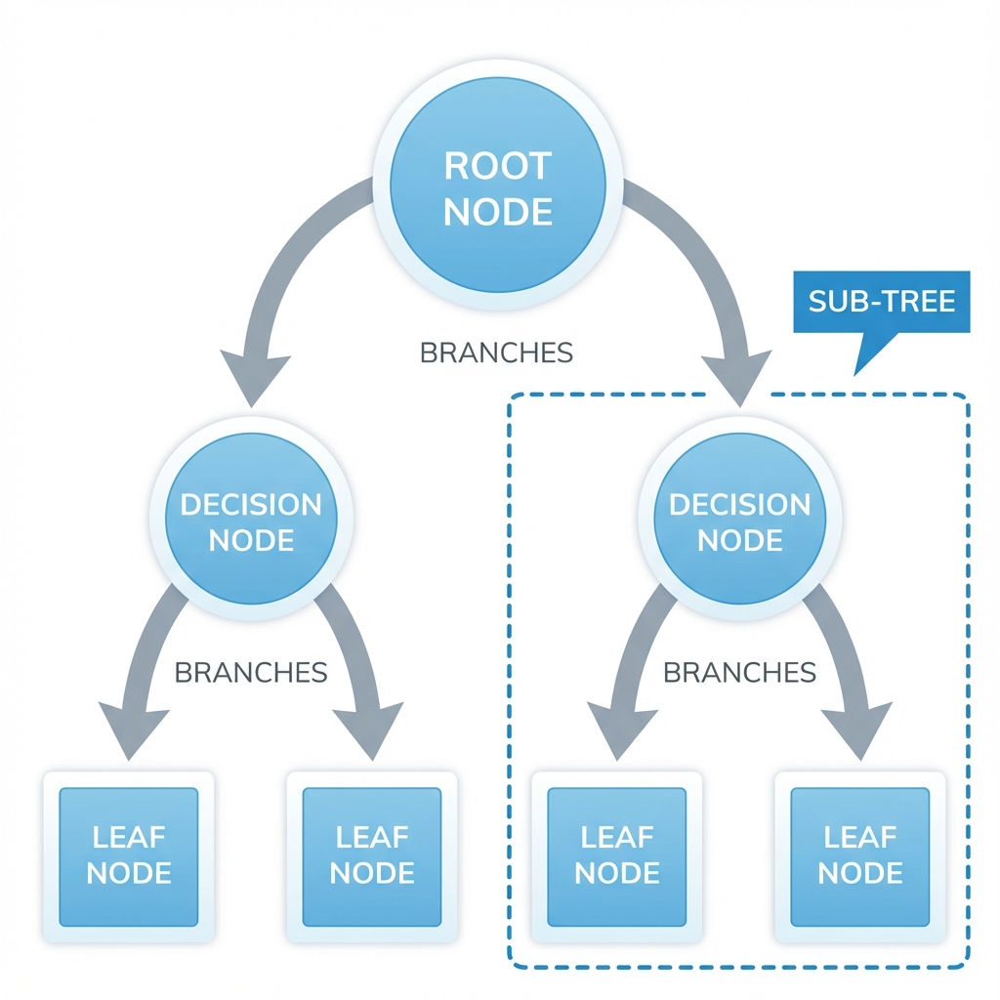
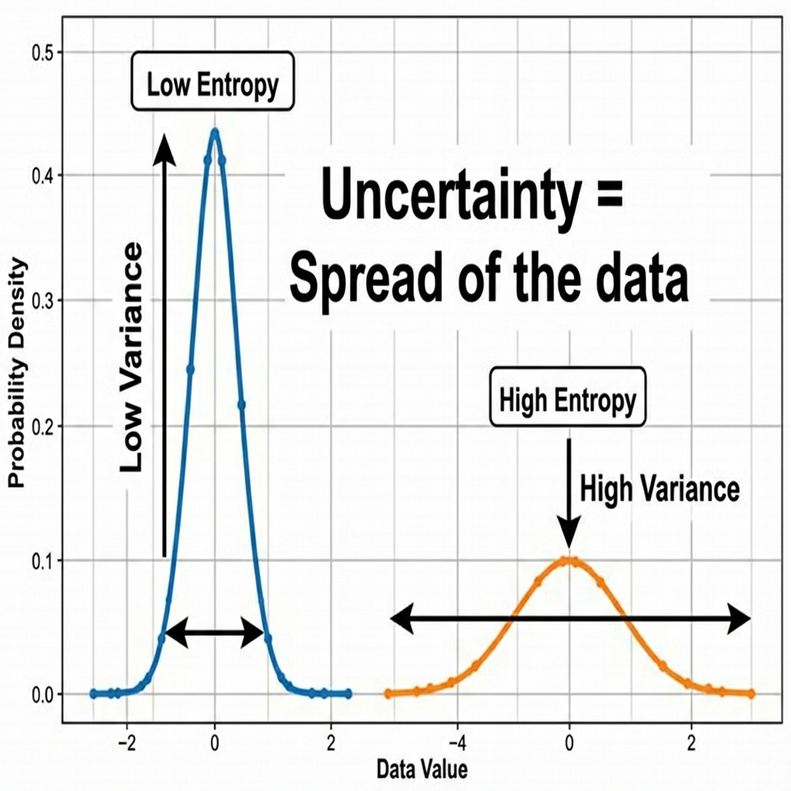

# Decision Trees: Intuition, Geometry, and Entropy

> **Goal**: To understand Decision Trees not just as simple rules, but as **Geometric Space Cutters** that minimize **Entropy**.

---

### 1. Intuition: The "20 Questions" Game
Imagine you are playing a game where you have to guess an object I'm thinking of, but you can only ask "Yes/No" questions.

*   **Q1**: Is it alive? $\rightarrow$ **Yes**.
*   **Q2**: Is it smaller than a cat? $\rightarrow$ **No**.
*   **Q3**: Does it bark? $\rightarrow$ **Yes**.
*   **Conclusion**: It's a **Dog**.

This is exactly how a Decision Tree works. It breaks down complex decisions into a sequence of simple, binary (True/False) comparisons.

---

### 2. The Geometric Intuition (Hyper-Cuboids)
This is where the "Machine Learning" perspective comes in.
Programmatically, a tree is `if-else`. **Mathematically, it is a Space Cutter.**

*   **Linear Models** (Logistic Regression): Draw a single straight line (or hyperplane) to separate classes. It can be diagonal.
*   **Decision Trees**: Draw **Orthogonal Cuts** (Parallel to axes).
    *   Cut 1: $X > 5$. (Vertical line).
    *   Cut 2: $Y < 3$. (Horizontal line).

By making these cuts, the tree divides the entire feature space into rectangular regions called **Hyper-cuboids**. Inside each region, the model makes a single prediction (e.g., "Mostly Red Points here, so predict Red").

<!-- 
IMAGE_PROMPT: 
Type: Split-Screen Comparison
Description: 
- Left: A Flowchart Tree. Root Node "X < 5?" splits to Left/Right. Subnode "Y < 5?" splits to Leafs.
- Right: A 2D Scatter Plot (X vs Y).
- Show a Vertical Line at X=5.
- Show a Horizontal Line at Y=5 (only on the right side of X=5).
- Label the regions as "Leaf 1", "Leaf 2", "Leaf 3".
Style: Educational, showing the mapping between Tree and Geometry.
-->

---

### 3. CART: Classification And Regression Trees
The Decision Tree algorithm (specifically **CART**) works for both types of problems.

| Feature | **Classification Tree** | **Regression Tree** |
| :--- | :--- | :--- |
| **Output** | A Class Label (e.g., "Yes" or "No"). | A Continuous Number (e.g., Salary). |
| **Decision** | **Majority Vote**: If a leaf has 5 Red and 1 Blue, predict Red. | **Average**: If a leaf has salaries $[5, 7, 9]$, predict $7$. |
| **Geometry** | Colored regions (Decision Boundaries). | A **Step Function** (Staircase-like). |

<!-- 
IMAGE_PROMPT: 
Type: Comparison Plot
Description: 
- Left (Classification): 2D plot with Red/Blue points. Rectangular regions colored Red or Blue.
- Right (Regression): A 2D plot (X vs Y). The prediction line looks like a Staircase (Step Function), jumping up and down at split points.
- Label: "Step Function for Regression".
Style: Mathematical Plot.
-->

---

### 4. How to Create a Tree (The Algorithm)
Building a tree is a **Recursive** process.

1.  **Analyze**: Look at the current dataset in the node.
2.  **Best Split**: Find the **Best Feature** and **Best Threshold** to split on.
    *   *Goal*: Make the resulting sub-nodes as "Pure" as possible.
    *   *Tool*: **Entropy** or **Gini Impurity**.
3.  **Split**: Divide the data into 2 subsets.
4.  **Repeat**: Treat each subset as a new dataset and repeat step 1.
5.  **Stop**: When the node is pure (only 1 class) or we reach a constraint (max depth).

---

### 5. Conclusion: The Dual Nature
We can summarize the essence of Decision Trees in two sentences:

> **Programmatically**: Decision Trees are a giant structure of **nested if-else conditions**.

> **Mathematically**: Decision Trees use hyperplanes **parallel to the axes** to cut the coordinate system into **hyper-cuboids**.

---

### 6. Terminology
*   **Root Node**: The very top node. Contains the entire dataset ($100\%$ of samples).
*   **Splitting**: The process of dividing a node.
*   **Decision Node**: A node that splits further.
*   **Leaf Node (Terminal)**: A node that does not split. This holds the final prediction.
*   **Pruning**: Opposite of splitting. Removing branches to prevent Overfitting.

<!-- 
IMAGE_PROMPT: 
Type: Diagram
Description: 
- A standard Tree structure.
- Circle at top labeled "Root Node".
- Arrows labeled "Branches".
- Middle circles labeled "Decision Nodes".
- Bottom circles (squares maybe) labeled "Leaf Nodes".
- Annotate one subtree as "Sub-Tree".
Style: Clean infographic.
-->

---

### 7. Pros and Cons

| Advantages | Disadvantages |
| :--- | :--- |
| **Interpretability**: You can visualize exactly *why* a decision was made. | **Overfitting**: Trees love to memorize noise. A tree with infinite depth fits training data 100% but fails on test data. |
| **No Scaling**: It checks $X > 5$. It doesn't care if $X$ is $0..1$ or $0..1000$. | **Instability**: A tiny change in data (one point moving) can completely change the tree structure. |
| **Non-Linear**: Can model complex circular/irregular shapes (using many small rectangles). | **Orthogonal**: Cannot capture diagonal relationships well (needs a "staircase" approximation). |

---

### 8. What is Entropy?
To build the tree, we need to measure **"Impurity"** or **"Messiness"**. We use **Entropy**.

> **Mantra**: "More Knowledge, Less Entropy."

*   **High Entropy**: Maximum unpredictability. (e.g., A coin toss is 50/50. You possess zero knowledge about the outcome).
*   **Low Entropy**: High predictability. (e.g., A coin with Head on both sides. You know the outcome 100%).

**The Physics Analogy**:
*   **Gas**: Molecules flying randomly. **High Entropy**.
*   **Ice**: Molecules fixed in a lattice. **Low Entropy**.

---

### 9. Calculating Entropy (Math)
The formula for Entropy $H(S)$ is:
$$ H(S) = - \sum_{i=1}^{K} p_i \log_2(p_i) $$

#### Example Calculation
Imagine a node with 5 animals: **2 Cats, 3 Dogs**.
*   $P(\text{Cat}) = 2/5 = 0.4$
*   $P(\text{Dog}) = 3/5 = 0.6$

$$ H = - [ (0.4 \log_2 0.4) + (0.6 \log_2 0.6) ] $$
$$ \log_2(0.4) \approx -1.32, \quad \log_2(0.6) \approx -0.73 $$
$$ H = - [ (0.4 \times -1.32) + (0.6 \times -0.73) ] $$
$$ H = - [ -0.528 - 0.438 ] = - [-0.966] \approx \mathbf{0.97} $$

*   **Result**: $0.97$ is high (Close to 1). This is an **Impure** node.
*   **Goal**: We want splits that reduce this Entropy towards 0.

---

### 10. Entropy vs Probability
If we plot Entropy for a binary case (Yes/No), it creates a specific curve.

*   At **50/50** split ($p=0.5$): Entropy is **1.0** (Maximum).
*   At **100/0** split ($p=1.0$): Entropy is **0.0** (Minimum).

<!-- 
IMAGE_PROMPT: 
Type: Graph
Description: 
- X-axis: Probability of Positive Class P(+). Range 0 to 1.
- Y-axis: Entropy H(S). Range 0 to 1.
- Curve: An inverted "U" (Parabola).
- Peak at (0.5, 1.0).
- Zeros at (0,0) and (1,0).
- Label: "Entropy is max when we are most confused (50/50)".
Style: Mathematical Graph.
-->

---

### 11. Entropy for Continuous Variables
What if the target is **Continuous** (e.g., Salary)?
We look at the **distribution** (Histogram).

*   **Peaked Distribution (Narrow)**: All salaries are close to $50k$. **Low Entropy**.
*   **Flat Distribution (Wide)**: Salaries range wildly from $10k$ to $1000k$. **High Entropy**.

> **Rule**: Whichever distribution is **Less Peaked** (Flatter) has **Higher Entropy** (More Uncertainty).

<!-- 
IMAGE_PROMPT: 
Type: Comparison Plot
Description: 
- Two Bell Curves (Normal Distributions).
- Curve A: Very tall and skinny (Low Variance). Label: "Low Entropy".
- Curve B: Very short and wide (High Variance). Label: "High Entropy".
- Text: "Uncertainty = Spread of the data".
Style: Statistical Plot.
-->

---

### 12. Interview Questions

**Q1: Why are Decision Tree boundaries always parallel to axes?**
*   **Ans**: Because every split is on a *single feature* at a time (e.g., is $X > 5$?). It does not compare features like $X > Y$ or $2X + 3Y > 5$ (which would create diagonals).

**Q2: What is the range of Entropy?**
*   **Ans**: For a binary classification, it is $[0, 1]$. For multiclass ($K$ classes), it can go up to $\log_2(K)$. (e.g., for 3 classes, max is $\sim 1.58$).

**Q3: How does a Decision Tree handle Regression?**
*   **Ans**: It uses the same splitting logic but minimizes **Variance** (or MSE) instead of Entropy. The prediction for a leaf is the **Mean** of the dependent variable values in that leaf, resulting in a **Step Function**.
