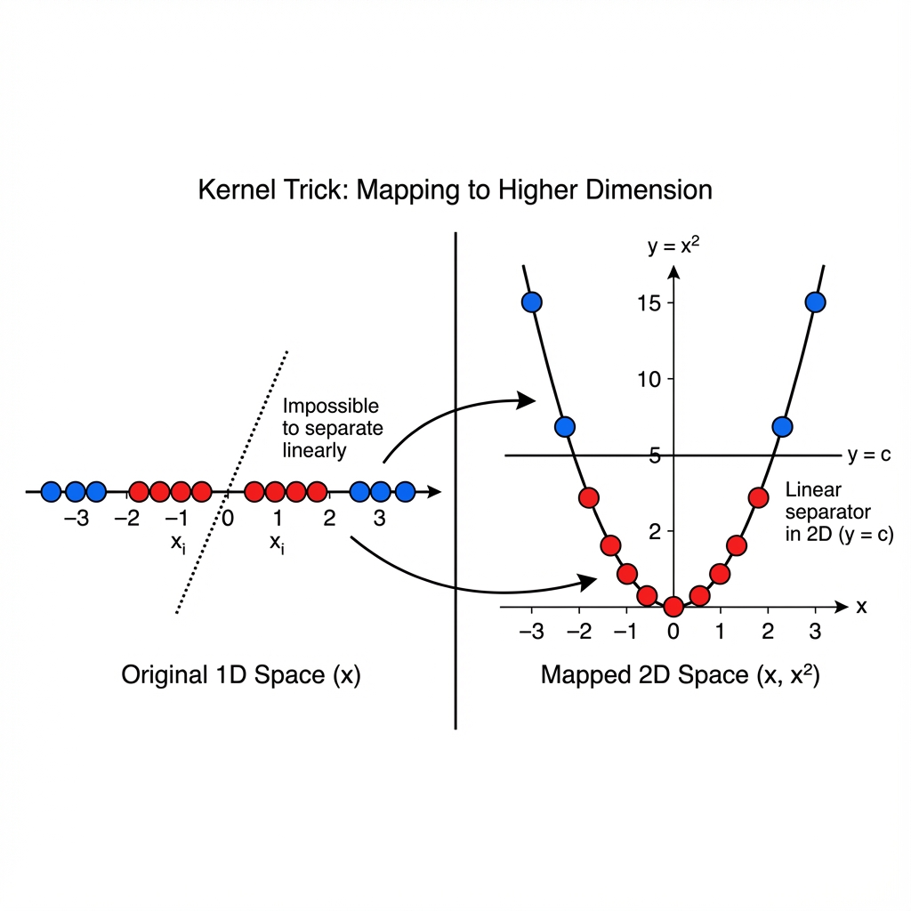

# SVM: Kernels and Non-Linearity

> **Goal**: Solving problems where data cannot be separated by a straight line (e.g., Concentric Circles).

---

### 1. The Limitation of Linear SVM
If you have a dataset where one class is in the center (Red) and the other surrounds it (Blue) like a donut, no straight line in the world can separate them.
A Linear SVM fails here ($\text{Accuracy} \approx 50\%$).

---

### 2. The Solution: Higher Dimensions
Imagine the "Donut" problem in 2D ($x_1, x_2$).
*   What if we add a 3rd dimension $z = x_1^2 + x_2^2$?
*   The center points (small $x$) will have low $z$ (Valley).
*   The outer points (large $x$) will have high $z$ (Hill).
*   Now, we can slice a **Flat Sheet** (Hyperplane) horizontally to separate the Hill from the Valley!

> **Key Idea**: Data that is not linearly separable in low dimensions **can** be linearly separable in higher dimensions.

---

### 3. The "Kernel Trick" (Visualizing Transformations)

#### A. 1D to 2D (The Parabola)
*   **Data**: Points on a line. Class 0 in the middle ($-2$ to $+2$), Class 1 at ends ($<-2, >+2$). Linear separation is impossible.
*   **Transform**: $f(x) = x^2$.
*   **Result**: The middle points stay low (near 0). The end points shoot up high ($9$).
*   **Cut**: A horizontal line at $y=4$ perfectly separates them!

<!-- 
IMAGE_PROMPT: 
Type: Transformation Diagram
Description: 
- Panel 1 (1D): A number line. Red points in middle (-2 to 2). Blue points at ends (-5 and +5).
- Arrow: "Transform x^2".
- Panel 2 (2D): A Parabola. Red points are at the bottom of the cup. Blue points are high up on the arms.
- A horizontal line cuts the Parabola, separating Red (Bottom) from Blue (Top).
Style: Mathematical Transformation.
-->

#### B. 2D to 3D (The Gaussian Lift)
*   **Data**: Concentric Circles (Red inside, Blue outside).
*   **Transform**: RBF Kernel (Gaussian).
*   **Result**: The center points are "lifted" into a Hill (Bump). The outer points remain in the Valley.
*   **Cut**: A flat sheet slices the top of the hill from the valley.

<!-- 
IMAGE_PROMPT: 
Type: 3D Surface Plot
Description: 
- 3D Plot with X, Y, Z axes.
- A "Hill" or "Bump" in the center (Gaussian distribution shape).
- Red points are sitting on top of the Hill.
- Blue points are in the flat valley surrounding the hill.
- A translucent plane (Hyperplane) slicing horizontally through the hill.
Style: 3D Scientific Visualization.
-->

> **Definition**: The Kernel Function $K(x_i, x_j)$ calculates the dot product in this high-dimensional space without actually doing the transformation.

---

### 4. Common Kernels

#### A. Polynomial Kernel
Maps data to polynomial dimensions ($x^2, x^3...$).
$$ K(x_1, x_2) = (x_1 \cdot x_2 + c)^d $$
*   Good for: Image processing, simple curved boundaries.

#### B. RBF (Radial Basis Function) Kernel
Maps data to **Infinite Dimensions**.
$$ K(x_1, x_2) = \exp(-\gamma ||x_1 - x_2||^2) $$
*   Creates "Islands" or "Hills" around support vectors.

#### C. Sigmoid Kernel
Often used as a proxy for Neural Networks.
$$ K(x_1, x_2) = \tanh(\alpha x_1^T x_2 + c) $$
*   Behaves like a refined Logistic Regression.

---

### 5. RBF Hyperparameter: Gamma ($\gamma$)
Gamma controls the "Reach" of a single training example.
$$ \gamma = \frac{1}{2\sigma^2} $$

*   **High Gamma**:
    *   Narrow reach. Each point forces a boundary tightly around itself.
    *   Result: Complex, wiggly boundary. **Overfitting**.
*   **Low Gamma**:
    *   Wide reach. Points influence a large area.
    *   Result: Smooth, simple boundary. **Underfitting**.

<!-- 
IMAGE_PROMPT: 
Type: RBF Gamma Comparison
Description: 
- Three plots of SVM boundaries on the same dataset.
- Plot 1 (Low Gamma): Very smooth, almost circular boundary.
- Plot 2 (Medium Gamma): Good fit.
- Plot 3 (High Gamma): The boundary creates tiny tight circles around individual points.
Style: Data Visualization.
-->

---

### 6. Summary: Parameters C vs Gamma

| Param | Role | High Value | Low Value |
| :--- | :--- | :--- | :--- |
| **C** | Misclassification Penalty. | Strict (Overfitting line). | Loose (Underfitting line). |
| **Gamma** | Reach of influence (RBF). | Local (Wiggly boundary). | Global (Smooth boundary). |
