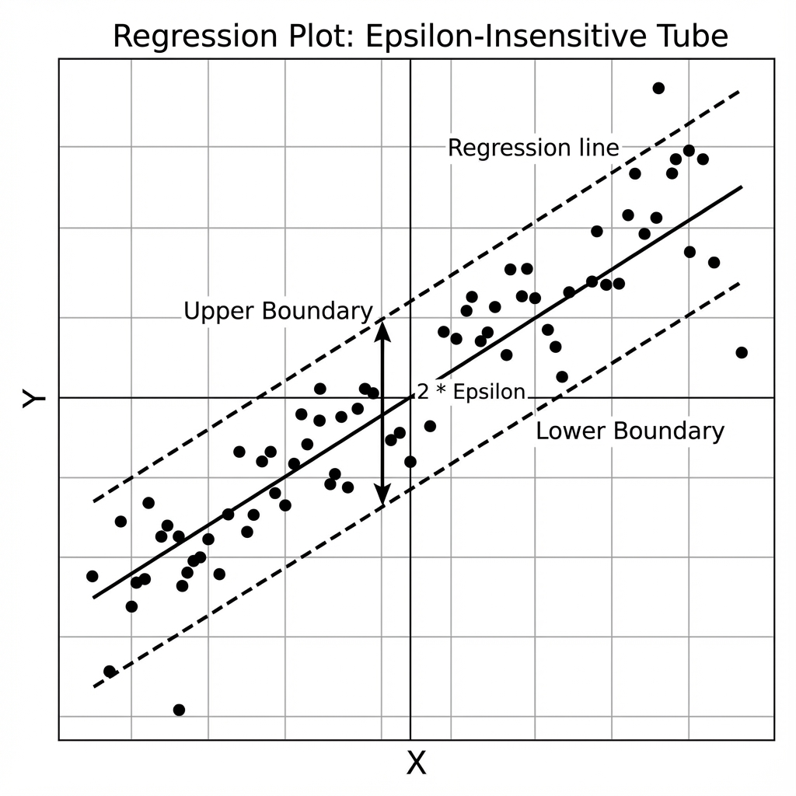

# SVM: Practical Implementation

> **Goal**: Implementing SVM for Classification (SVC) and Regression (SVR) using Scikit-Learn.

---

### 1. Support Vector Classifier (SVC)
**Scenario**: Classifying Cancer Malignancy (Non-linear data).

```python
import pandas as pd
from sklearn.datasets import load_breast_cancer
from sklearn.model_selection import train_test_split
from sklearn.svm import SVC
from sklearn.metrics import accuracy_score, classification_report

# 1. Load
data = load_breast_cancer()
X, y = data.data, data.target
X_train, X_test, y_train, y_test = train_test_split(X, y, test_size=0.2, random_state=42)

# 2. Scale Data (CRITICAL for SVM!)
# SVM relies on distance. If one feature is 1000x larger, it dominates.
from sklearn.preprocessing import StandardScaler
scaler = StandardScaler()
X_train = scaler.fit_transform(X_train)
X_test = scaler.transform(X_test)

# 3. Train Model
# Kernel='rbf' is default. C=1.0 is default.
model = SVC(kernel='rbf', C=1.0, gamma='scale')
model.fit(X_train, y_train)

# 4. Evaluate
y_pred = model.predict(X_test)
print(classification_report(y_test, y_pred))
```

---

### 2. Support Vector Regression (SVR)
SVM works for regression too! Instead of a "Street" that *separates* classes, SVR tries to fit a "Street" (Tube) that **contains** as many points as possible within a margin $\epsilon$ (Epsilon).

```python
from sklearn.svm import SVR

# 1. Initialize
# epsilon: How much error do we ignore?
regressor = SVR(kernel='rbf', C=100, gamma=0.1, epsilon=0.1)

# 2. Train
regressor.fit(X_train, y_train)

# 3. Predict
print(regressor.predict(X_test[:2]))
```

<!-- 
IMAGE_PROMPT: 
Type: Regression Plot
Description: 
- 2D Scatter plot (X vs Y). Points follow a linear trend with some noise.
- A Regression Line (Middle).
- Two parallel dashed lines (Upper and Lower bounds) creating a "Tube" around the regression line.
- Most points are inside the tube. A few are outside.
- Label the width of the tube as "2 * Epsilon".
Style: Mathematical Graph.
-->



---

### 3. Visualizing Hyperparameters
Understanding `C` and `Gamma` visually.

```python
import numpy as np
import matplotlib.pyplot as plt

def plot_boundary(model, X, y):
    # Helper to meshgrid and plot contour
    x_min, x_max = X[:, 0].min() - 1, X[:, 0].max() + 1
    y_min, y_max = X[:, 1].min() - 1, X[:, 1].max() + 1
    xx, yy = np.meshgrid(np.arange(x_min, x_max, 0.02),
                         np.arange(y_min, y_max, 0.02))
    Z = model.predict(np.c_[xx.ravel(), yy.ravel()])
    Z = Z.reshape(xx.shape)
    plt.contourf(xx, yy, Z, alpha=0.8)
    plt.scatter(X[:, 0], X[:, 1], c=y, edgecolors='k')

# Example: High Gamma (Overfitting)
model_high_gamma = SVC(kernel='rbf', gamma=10, C=1)
model_high_gamma.fit(X_train[:, :2], y_train) # Using only 2 features for 2D plot
plot_boundary(model_high_gamma, X_train[:, :2], y_train)
plt.title("High Gamma (Overfitting)")
plt.show()
```

---

### 4. Tips for Interview & Practice

*   **Scaling is Mandatory**: Always use `StandardScaler` or `MinMaxScaler`. SVM is not scale-invariant like Decision Trees.
*   **Grid Search**: SVM requires tuning `C` and `Gamma`. They usually interact. Finding the "sweet spot" is key.
*   **Kernel Choice**: Start with `RBF`. If data is very high-dimensional (Text, Genes), `Linear` might work better (and faster).
