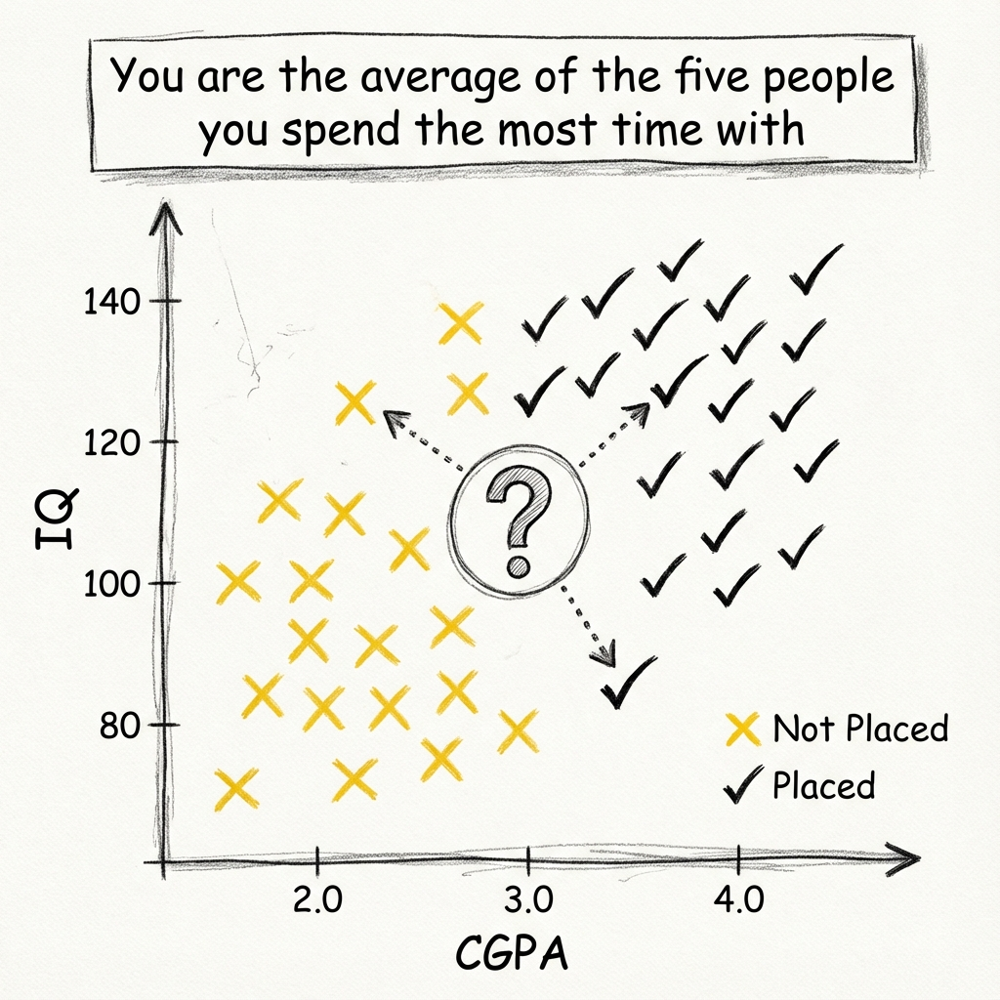

# K-Nearest Neighbors (KNN) - Intuition

> **"You are the average of the five people you spend the most time with."** — *Jim Rohn*

This famous self-help quote perfectly summarizes the **K-Nearest Neighbors (KNN)** algorithm.

### 1. The Core Intuition
KNN is a simple, intuitive, and non-parametric supervised learning algorithm used for both **Classification** and **Regression**.
*   **Concept**: To classify a new data point, look at its "neighbors" in the dataset. If the majority of neighbors are "Red", the new point is likely "Red".
*   **Analogy**:
    *   If you walk like a duck, quack like a duck, and look like a duck (i.e., your neighbors are ducks), you are probably a duck.

---

### 2. Geometric Interpretation
Imagine we have a dataset of students:
*   **Class 0 (Yellow)**: Not Placed ($x \to 0$).
*   **Class 1 (Black)**: Placed ($x \to 1$).
*   **Features**: IQ (Y-axis) vs CGPA (X-axis).

<!-- 
IMAGE_PROMPT: 
Type: Concept Plot
Description: 
- 2D scatter plot with 'CGPA' on X-axis and 'IQ' on Y-axis.
- Yellow 'X' marks for 'Not Placed'.
- Black 'tick' marks for 'Placed'.
- A new query point '?' in the middle.
- Arrows pointing from '?' to the nearest 3 neighbors.
- Quote annotation: "You are the average of the five people..."
Style: Hand-drawn diagram style matching user notes.
-->

**How it works**:
1.  We plot all **100 data points**.
2.  For a new student (Query Point), we find the $K$ closest students geometrically.
3.  We vote based on their labels.

---

### 3. Why is Scaling "StandardScaler" Critical?
**Note form**: *"Try to scale all data in same scale. why? -> bcz KNN works on distances."*

KNN is strictly based on **Distance** (Euclidean, Manhattan).
If features have different scales, the distance calculation breaks.

**Example**:
*   Using **Height (cm)** [150-190] and **Weight (kg)** [50-100].
*   If we change Height to **millimeters** [1500-1900], the distance contribution of Height explodes by 10x.
*   The algorithm will only care about Height and ignore Weight.
*   **Fix**: Always use `StandardScaler` to bring all features to the same scale ($\mu=0, \sigma=1$).

---

### 4. Comparison with Other Models
*   **Linear Regression/SVM**: Eager Learners. They try to find a function $y=f(x)$ (Line/Hyperplane) during training.
*   **KNN**: **Lazy Learner**. It doesn't learn anything during training. It just memorizes the data. It computes distances only when you ask for a prediction.

### Interview Questions

**Q1: Why is KNN called a Lazy Learner?**
*   **Ans**: It does **zero** work during training. It simply stores the training data. All the computation (distance calculation) happens at **inference time** ( prediction).
    *   *Pro*: Training is instant $O(1)$.
    *   *Con*: Prediction is slow $O(N)$.

**Q2: Can KNN be used for Regression?**
*   **Ans**: Yes. Instead of "Majority Vote" (Mode), we take the **Average (Mean)** of the $K$ nearest neighbors' target values.

**Q3: What is the impact of Feature Scaling on KNN?**
*   **Ans**: Massive. Since KNN relies on Euclidean distance, features with larger magnitudes will dominate the distance formula, acting like "fake weights". Scaling ensures every feature contributes equally.
